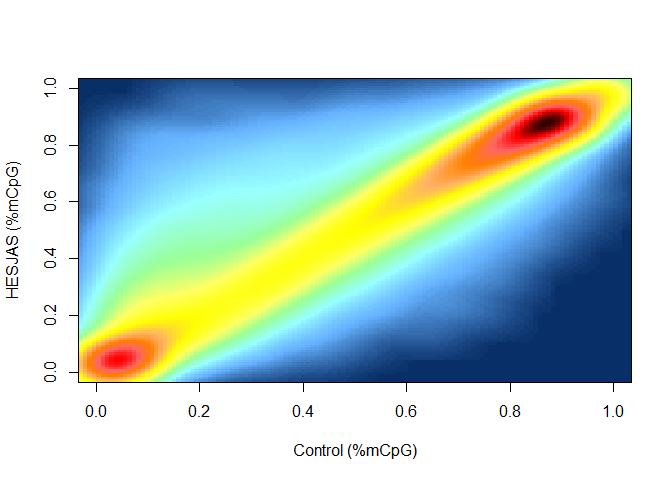
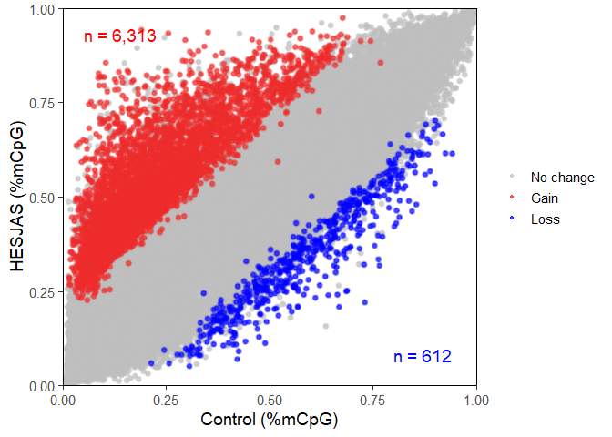
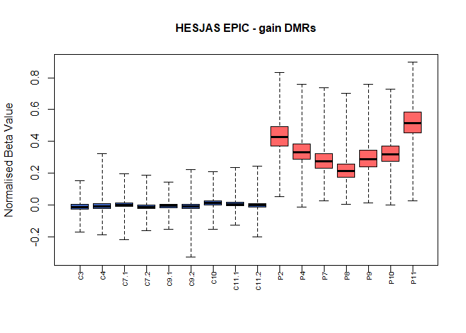
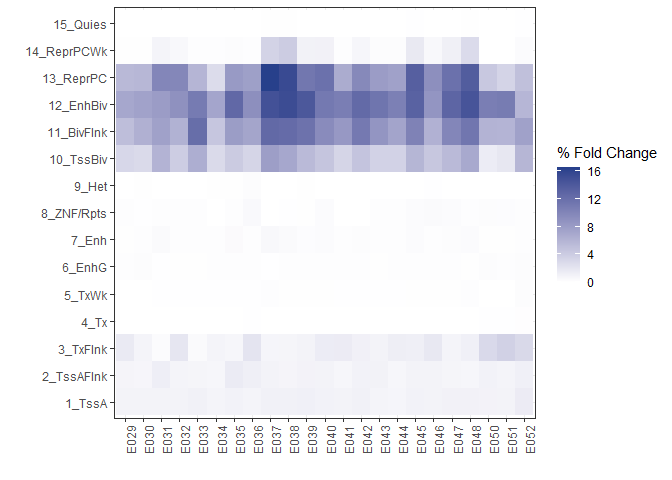
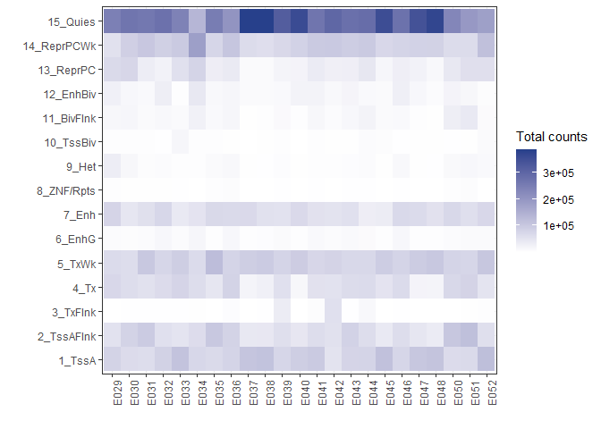
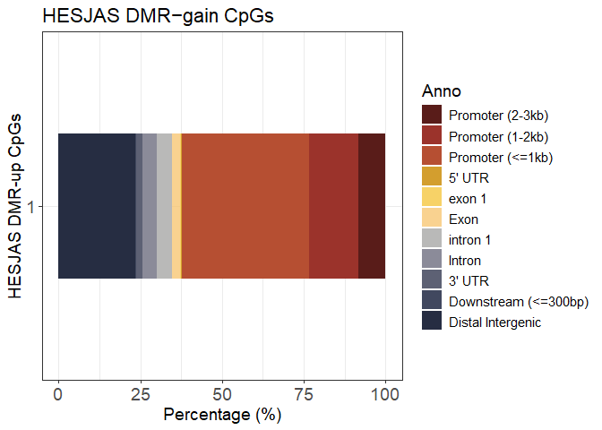
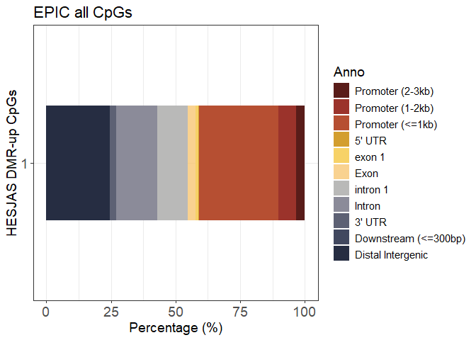
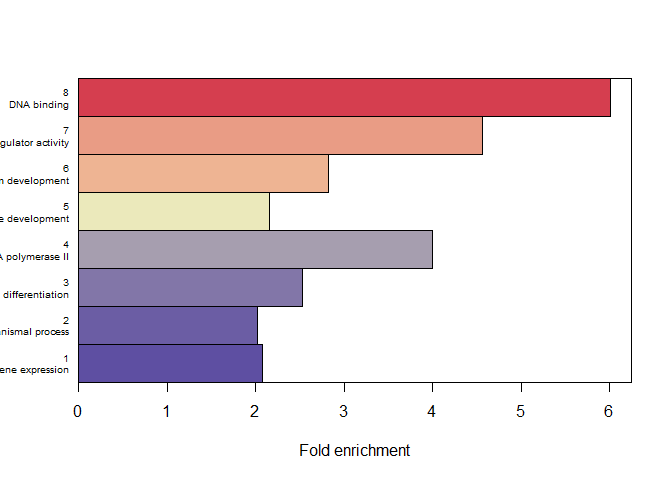

Sarni et al., Extended Data Figure 1
================
dsarni
03-03-2026

## Extended Figure 1. HESJAS DNMT3A GOF mutations cause hypermethylation at Polycomb-marked regions

1.  libraires used in this figure.

``` r
library(ggplot2)
library(RColorBrewer)
library(stringr)
```

2.  Import data

``` r
# EDF1.c
hesjas_epic_density_df <- read.table("../data/EDF1/hesjas_epic_mCpG_density.tsv.gz", header = T)

# EDF1.d
hDMR_blood_beta_norm <- read.csv("../data/EDF1/hesjas_epic_dmr_gain_norm.csv")

# EDF1.e
hDMR_chromHMM <- read.csv("../data/EDF1/combined_summaries_hDMV_101125.csv")

#EDF1.f
hesjas_epic_dmr_gain_anno <- read.csv("../data/EDF1/hesjas_epic_dmr_gain_anno.csv")
hesjas_epic_all_anno <- read.csv("../data/EDF1/all_epic_cg_freq_feature_anno.csv")

# EDF1.f
go_top10 <- read.csv("../data/EDF1/table_go_all_excl_top10.csv")
```

### EDF1.c

Plot density plot

``` r
smoothScatter(hesjas_epic_density_df[[15]], hesjas_epic_density_df[[16]], nrpoints=0,
              xlab = "Control (%mCpG)", ylab = "HESJAS (%mCpG)",
              colramp = colorRampPalette(c("#092F68",
                                           "#66B2FF",
                                           "#99FFFF",
                                           "#99FF99", 
                                           "#FFFF66",
                                           "#FFFF00", 
                                           "#FFB266", 
                                           "#FF8000",
                                           "#FF6666", 
                                           "#FF0000", 
                                           "#330000")))
```

<!-- -->

Plot scatter plot

``` r
p.scat.color.epic <- ggplot(data = hesjas_epic_density_df, aes(x = wt, y = mut, color = as.factor(group)))+
  ggrastr::rasterise(geom_point(size = 0.9, alpha = 0.7))+
  scale_color_manual(labels = c("No change", "Gain", "Loss"), values=c("grey","firebrick2","blue"))+
  scale_x_continuous(limits = c(0, 1), expand = c(0, 0)) +
  scale_y_continuous(limits = c(0, 1), expand = c(0, 0)) +
  labs(x = "Control (%mCpG)",
       y = "HESJAS (%mCpG)")+
  theme_bw(base_size = 14) +
  theme(
    panel.grid = element_blank(),
    panel.border = element_rect(color = "black", fill = NA,),
    legend.title = element_blank()
  )

p.scat.color.epic.v2 <- p.scat.color.epic+
  annotate("text", x = .05, y = .95,
           label = "n = 6,313", color = "red",
           hjust = 0, vjust = 1, size = 5) +
  annotate("text", x = .8, y = .1,
           label = "n = 612", color = "blue",
           hjust = 0, vjust = 1, size = 5) 

print(p.scat.color.epic.v2)
```

<!-- -->

### EDF1.d

``` r
hDMR_blood_beta_norm <- hDMR_blood_beta_norm[,2:17]

boxplot(hDMR_blood_beta_norm[,1:16],
        names=rep("", times=16), range=0, col = c(rep("#4169C4",9),rep("#FF6666",7)),
        ylab="Normalised Beta Value", cex.main=1, main="HESJAS EPIC - gain DMRs")
mtext(colnames(hDMR_blood_beta_norm)[1:16], line=0.5, side=1, at=c(1:16),
      cex=0.6, las=2)
```

<!-- -->

### EDF1.e

A function to plot heatmap of fold changes

``` r
plot_heatmap_fc <- function(data) {
  
  ggplot(data, aes(x = table, y = reorder(States, as.numeric(str_extract(States, "\\d+"))), fill = fold_change)) +
    geom_tile() +
    scale_fill_gradient(low = "white", high = "royalblue4") +
    labs(x = "", y = "", fill = "% Fold Change") +
    theme_bw() +
    theme(axis.text.x = element_text(angle = 90, hjust = 1))
}
```

``` r
plot_heatmap_fc(hDMR_chromHMM)
```

<!-- --> A function to
plot Total counts

``` r
plot_heatmap_toal_counts <- function(data) {
  
  ggplot(data, aes(x = table, y = reorder(States, as.numeric(str_extract(States, "\\d+"))), fill = total_count)) +
    geom_tile() +
    scale_fill_gradient(low = "white", high = "royalblue4") +
    labs(x = "", y = "", fill = "Total counts") +
    theme_bw() +
    theme(axis.text.x = element_text(angle = 90, hjust = 1))
}
```

``` r
plot_heatmap_toal_counts(hDMR_chromHMM)
```

<!-- -->

### EDF1.f

``` r
hesjas_epic_dmr_gain_anno$Anno <- factor(hesjas_epic_dmr_gain_anno$Anno, levels = hesjas_epic_dmr_gain_anno$Anno)

hesjas_epic_all_anno$Anno <- factor(hesjas_epic_all_anno$Anno, levels = hesjas_epic_all_anno$Anno)
```

``` r
ggplot(data = hesjas_epic_dmr_gain_anno, aes(x = factor(1), y = perc, fill = Anno))+
  geom_col(position = "stack", width = 0.5)+
  coord_flip()+
  scale_fill_manual(values = c("#591C19FF", "#9B332BFF", "#B64F32FF", "#D39e2eFF", "#F7d267ff", "#f7C267bb","#B9B9B8FF", "#8B8B99FF", "#5D6174FF", "#41485FFF", "#262D42FF"))+
  labs(x = "HESJAS DMR-up CpGs",
       y = "Percentage (%)",
       title = "HESJAS DMR−gain CpGs")+
  theme_bw()+
  theme(text = element_text(size = 14), axis.text = element_text(size = 14))
```

<!-- -->

``` r
ggplot(data = hesjas_epic_all_anno, aes(x = factor(1), y = perc, fill = Anno))+
  geom_col(position = "stack", width = 0.5)+
  coord_flip()+
  scale_fill_manual(values = c("#591C19FF", "#9B332BFF", "#B64F32FF", "#D39e2eFF", "#F7d267ff", "#f7C267bb","#B9B9B8FF", "#8B8B99FF", "#5D6174FF", "#41485FFF", "#262D42FF"))+
  labs(x = "HESJAS DMR-up CpGs",
       y = "Percentage (%)",
       title = "EPIC all CpGs")+
  theme_bw()+
  theme(text = element_text(size = 14), axis.text = element_text(size = 14))
```

<!-- -->

### EDF1.g

``` r
col.pal.base.1 <-c("#FFFFBF", "#D53E4F")
col.pal.base.2 <-c("#FFFFBF", "#5E4FA2")
col.func.1 <- colorRampPalette(col.pal.base.1)
col.func.2 <- colorRampPalette(col.pal.base.2)

log10padj.col <- c(rev(col.func.2(50)), col.func.1(50))
```

``` r
breaks_go_top10 <- seq(from=min(go_top10$log10.padj.up), to=max(go_top10$log10.padj.up), by=(max(go_top10$log10.padj.up)-min(go_top10$log10.padj.up))/100)

bin_go_top10 <- cut(go_top10$log10.padj.up, breaks=breaks_go_top10, include.lowest = TRUE)
levels(bin_go_top10) <- c(1:100)
bin_go_top10 <- as.vector(bin_go_top10, mode="numeric")
```

``` r
midpoints <- barplot(height=go_top10$per.fc.up,
space=0, yaxs="i", col=log10padj.col[bin_go_top10],
horiz=TRUE, xlim=c(0, 1.04*max(go_top10$per.fc.up)), xaxs="i", xlab="Fold enrichment")
box()
mtext(text=paste(rownames(go_top10), go_top10$description, sep="\n"),
at=c(midpoints), side=2, las=2, cex=0.6, line=0.5)
```

<!-- -->

``` r
sessionInfo()
```

    ## R version 4.5.0 (2025-04-11 ucrt)
    ## Platform: x86_64-w64-mingw32/x64
    ## Running under: Windows 11 x64 (build 26100)
    ## 
    ## Matrix products: default
    ##   LAPACK version 3.12.1
    ## 
    ## locale:
    ## [1] LC_COLLATE=English_United Kingdom.utf8 
    ## [2] LC_CTYPE=English_United Kingdom.utf8   
    ## [3] LC_MONETARY=English_United Kingdom.utf8
    ## [4] LC_NUMERIC=C                           
    ## [5] LC_TIME=English_United Kingdom.utf8    
    ## 
    ## time zone: Europe/London
    ## tzcode source: internal
    ## 
    ## attached base packages:
    ## [1] stats     graphics  grDevices utils     datasets  methods   base     
    ## 
    ## other attached packages:
    ## [1] stringr_1.6.0      RColorBrewer_1.1-3 ggplot2_4.0.2     
    ## 
    ## loaded via a namespace (and not attached):
    ##  [1] gtable_0.3.6       dplyr_1.2.0        compiler_4.5.0     tidyselect_1.2.1  
    ##  [5] ggbeeswarm_0.7.3   scales_1.4.0       yaml_2.3.12        fastmap_1.2.0     
    ##  [9] R6_2.6.1           labeling_0.4.3     generics_0.1.4     knitr_1.51        
    ## [13] Cairo_1.7-0        tibble_3.3.1       pillar_1.11.1      rlang_1.1.7       
    ## [17] stringi_1.8.7      xfun_0.57          S7_0.2.1           otel_0.2.0        
    ## [21] cli_3.6.5          withr_3.0.2        magrittr_2.0.4     digest_0.6.39     
    ## [25] grid_4.5.0         rstudioapi_0.18.0  beeswarm_0.4.0     lifecycle_1.0.5   
    ## [29] ggrastr_1.0.2      vipor_0.4.7        vctrs_0.7.2        KernSmooth_2.23-26
    ## [33] evaluate_1.0.5     glue_1.8.0         farver_2.1.2       rmarkdown_2.31    
    ## [37] tools_4.5.0        pkgconfig_2.0.3    htmltools_0.5.9
