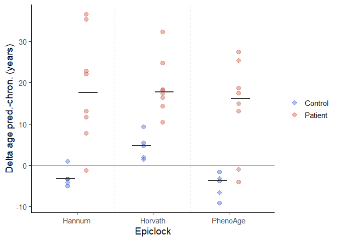
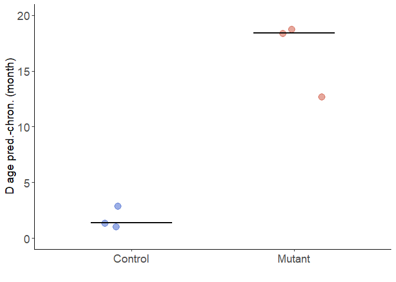

Extended Figure Data 10
================
dsarni
04-03-2026

## Extended Data Figure 10. Examples of hypermethylated transcription factor promoter regions; accelerated epigenetic clock ageing in HESJAS

1.  Libraries used in this figure.

``` r
library(ggplot2)
```

2.  Import data.

``` r
# EDF10.e
human_epiClocks <- read.table("../data/EDF10/human_epiclock_hesjas.tsv", header = T)

# EDF10.f
mouse_epiClock <- read.csv("../data/EDF10/mouse_epiclock.csv")
```

### EDF10.e

3.  Plot epiclock age predictions for HESJAS patients and controls

``` r
ggplot(human_epiClocks, aes(x = variable, y = value, color = Geno)) +
  geom_jitter(position = position_dodge(width = 0.5), size = 3, alpha = 0.4) + #width = 0.2,
  stat_summary(aes(group = Geno), fun = median, geom = "crossbar",
               position = position_dodge(width = 0.6),
               width = 0.5, fatten = 2, color = "grey20") +
  geom_vline(xintercept = seq(1.5, length(unique(human_epiClocks$variable)) - 0.5, 1),
             linetype = "dashed", color = "grey75") +
  geom_hline(yintercept = 0, color = "grey65") +
  theme_classic(base_size = 14) +
  theme(legend.title = element_blank()) +
  labs(x = "Epiclock", y = "Delta age pred.-chron. (years)") +
  scale_color_manual(values = c("Control" = "royalblue3", "Patient" = "tomato3"))
```

<!-- -->

4.  Compute *p-values*

- Hannum clock

``` r
# Hannum
hannum_df <- subset(human_epiClocks, variable == "Hannum")

t.test(value ~ Geno, data = hannum_df, var.equal = F)
```

    ## 
    ##  Welch Two Sample t-test
    ## 
    ## data:  value by Geno
    ## t = -4.4917, df = 7.6738, p-value = 0.002247
    ## alternative hypothesis: true difference in means between group Control and group Patient is not equal to 0
    ## 95 percent confidence interval:
    ##  -32.53596 -10.35316
    ## sample estimates:
    ## mean in group Control mean in group Patient 
    ##             -2.913567             18.530991

- Horvath clock

``` r
# Horvath
horvath_df <- subset(human_epiClocks, variable == "Horvath")

t.test(value ~ Geno, data = horvath_df, var.equal = F)
```

    ## 
    ##  Welch Two Sample t-test
    ## 
    ## data:  value by Geno
    ## t = -5.204, df = 10.542, p-value = 0.0003361
    ## alternative hypothesis: true difference in means between group Control and group Patient is not equal to 0
    ## 95 percent confidence interval:
    ##  -20.499308  -8.267707
    ## sample estimates:
    ## mean in group Control mean in group Patient 
    ##               4.61649              19.00000

- PhenoAge clock

``` r
# PhenoAge
phenoAge_df <- subset(human_epiClocks, variable == "PhenoAge")

t.test(value ~ Geno, data = phenoAge_df, var.equal = F)
```

    ## 
    ##  Welch Two Sample t-test
    ## 
    ## data:  value by Geno
    ## t = -4.4651, df = 8.489, p-value = 0.00181
    ## alternative hypothesis: true difference in means between group Control and group Patient is not equal to 0
    ## 95 percent confidence interval:
    ##  -28.462091  -9.203093
    ## sample estimates:
    ## mean in group Control mean in group Patient 
    ##             -4.826926             14.005666

### EDF10.f

5.  Convert the age delta predictions from days to months

``` r
mouse_epiClock$delta_month <- mouse_epiClock$Age_delta/30.5
```

6.  Plot mouse epiclock age predictions delta

``` r
ggplot(data = mouse_epiClock, aes(x = Condition, y = delta_month, color = as.factor(Condition)))+
  geom_jitter(size = 4, alpha = 0.5, width = .2)+
  scale_color_manual(values = c("Control" = "royalblue3", "Mutant" = "tomato3"))+
  ylab("D age pred.-chron. (month)")+
  xlab("")+
  ylim(c(0,20))+
  stat_summary(fun = median, geom = "crossbar", color = "black", width = 0.5, linewidth = 0.5, fatten = 2, show.legend = T)+
  theme_classic()+
  theme(text = element_text(size = 14),
        axis.text = element_text(size = 14),
        legend.position = "none")
```

<!-- -->

7.  Compute *p-values*

``` r
t.test(delta_month ~ Condition, data = mouse_epiClock, var.equal = F)
```

    ## 
    ##  Welch Two Sample t-test
    ## 
    ## data:  delta_month by Condition
    ## t = -7.3179, df = 2.3508, p-value = 0.01145
    ## alternative hypothesis: true difference in means between group Control and group Mutant is not equal to 0
    ## 95 percent confidence interval:
    ##  -22.420299  -7.247911
    ## sample estimates:
    ## mean in group Control  mean in group Mutant 
    ##              1.772883             16.606988

``` r
sessionInfo()
```

    ## R version 4.5.0 (2025-04-11 ucrt)
    ## Platform: x86_64-w64-mingw32/x64
    ## Running under: Windows 11 x64 (build 26100)
    ## 
    ## Matrix products: default
    ##   LAPACK version 3.12.1
    ## 
    ## locale:
    ## [1] LC_COLLATE=English_United Kingdom.utf8 
    ## [2] LC_CTYPE=English_United Kingdom.utf8   
    ## [3] LC_MONETARY=English_United Kingdom.utf8
    ## [4] LC_NUMERIC=C                           
    ## [5] LC_TIME=English_United Kingdom.utf8    
    ## 
    ## time zone: Europe/London
    ## tzcode source: internal
    ## 
    ## attached base packages:
    ## [1] stats     graphics  grDevices utils     datasets  methods   base     
    ## 
    ## other attached packages:
    ## [1] ggplot2_3.5.2
    ## 
    ## loaded via a namespace (and not attached):
    ##  [1] vctrs_0.6.5        cli_3.6.5          knitr_1.50         rlang_1.1.6       
    ##  [5] xfun_0.52          generics_0.1.4     labeling_0.4.3     glue_1.8.0        
    ##  [9] htmltools_0.5.8.1  scales_1.4.0       rmarkdown_2.29     grid_4.5.0        
    ## [13] evaluate_1.0.4     tibble_3.3.0       fastmap_1.2.0      yaml_2.3.10       
    ## [17] lifecycle_1.0.4    compiler_4.5.0     dplyr_1.1.4        RColorBrewer_1.1-3
    ## [21] pkgconfig_2.0.3    rstudioapi_0.17.1  farver_2.1.2       digest_0.6.37     
    ## [25] R6_2.6.1           tidyselect_1.2.1   pillar_1.11.0      magrittr_2.0.3    
    ## [29] withr_3.0.2        tools_4.5.0        gtable_0.3.6
