Sarni et al., Extended Data Figure 4
================
dsarni
03-03-2026

## Extended Data Figure 4. Dnmt3a W326R/+ leads to progressive hypermethylation in adult mouse tissues

1.  libraires used in this figure.

``` r
library(dplyr)
library(ggplot2)
library(RColorBrewer)
library(stringr)
library(tidyr)
```

2.  Import data.

``` r
### EDF4.g-l ###
# Intestine
int <- read.csv("../data/EDF4/int_all_dmr_mean_age.csv")
int.ctrl <- read.csv("../data/EDF4/in.all.dmr.data.ctrl.mean.csv")
# Bone marrow
bm <- read.csv("../data/EDF4/bm_all_dmr_mean_age.csv")
bm.ctrl <- read.csv("../data/EDF4/bm.all.dmr.data.ctrl.mean.csv")
# Liver
li <- read.csv("../data/EDF4/li_all_dmr_mean_age.csv")
li.ctrl <- read.csv("../data/EDF4/li.all.dmr.data.ctrl.mean.csv")

### EDF4.m,n
int.11.cat <- read.csv("../data/EDF4/int_11_categories_summaires.csv") # Intestine
bm.11.cat <- read.csv("../data/EDF4/bm_11_categories_summaires.csv") # Bone marrow
li.11.cat <- read.csv("../data/EDF4/liv_11_categories_summaires.csv") # Liver

### EDF4.o
int.anno <- read.csv("../data/EDF4/int_Anno_peak_summary.csv") # Intestine
bm.anno <- read.csv("../data/EDF4/bm_Anno_peak_summary.csv") # Bone marrow
li.anno <- read.csv("../data/EDF4/liv_Anno_peak_summary.csv") # Liver

# Total CpG
total_mm10_array <- read.csv("../data/EDF4/mm10_Array_Anno_peak_summary.csv")
```

### EDF4.g-l

<b><u> Intestine </u></b>

3.  Convert the mean age data into a format suitable for ggplot for
    heatmaps Convert the mean age data into a format suitable for ggplot

``` r
# Intestine
int.df <- data.frame(Time = rep(c(rep("4d", length(int[[1]])),
                             rep("23d", length(int[[1]])),
                             rep("3m", length(int[[1]])),
                             rep("1yr", length(int[[1]]))),2),
                    Geno = c(rep("+/+",length(int[[1]])*4),
                             rep("W326R/+",length(int[[1]])*4)),
                    Value = c(int$c.4d,
                              int$c.23d,
                              int$c.3m,
                              int$c.1yr,
                              int$m.4d,
                              int$m.23d,
                              int$m.3m,
                              int$m.1yr))

int.df$Group <- interaction(int.df$Geno, int.df$Time, sep = "_")
```

4.  Order samples for plotting

``` r
group_levels_int <- levels(factor(int.df$Group))
group_levels_int <- c(group_levels_int[7],
                  group_levels_int[3],
                  group_levels_int[5],
                  group_levels_int[1],
                  group_levels_int[8],
                  group_levels_int[4],
                  group_levels_int[6],
                  group_levels_int[2])
group_levels_int
```

    ## [1] "+/+_4d"      "+/+_23d"     "+/+_3m"      "+/+_1yr"     "W326R/+_4d" 
    ## [6] "W326R/+_23d" "W326R/+_3m"  "W326R/+_1yr"

``` r
int.df$Group <- factor(int.df$Group, levels = group_levels_int)
```

5.  Plot heatmpap all individual samples - intestine

``` r
image(x=c(1:ncol(int[,2:25])),y=c(1:nrow(int)),
      z=t(int[order(int.ctrl$x), 2:25]),
      col=rev(brewer.pal(10,"RdYlBu")),breaks=seq(0,1,by=0.1),
      axes=FALSE,xlab="",ylab="gain DMRs (n=762)")
box()
mtext(colnames(int[,2:25]), line=0.5, side=1, at=c(1:24),
      cex=0.6, las=2)
```

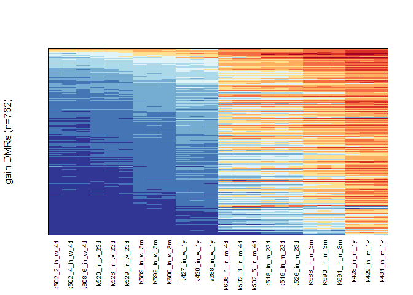<!-- -->

6.  Plot boxplot for mean DNA methylation per age per genotype -
    intestine

``` r
ggplot(int.df, aes(x = Geno, y = Value, fill = Group)) +
  stat_boxplot(
    position = position_dodge(0.8),
    geom = "errorbar",
    width = 0.4
  ) +
  geom_boxplot(position = position_dodge(width = 0.8), 
               colour = NA) +
  stat_summary(
    fun = median,
    geom = "crossbar",
    width = 0.75,
    colour = "black",
    position = position_dodge(0.8)
  ) +
  ylim(c(0,1))+
  scale_fill_manual(values = c(
    "+/+_4d" = "#d4def1",
    "+/+_23d" = "#90bde5",
    "+/+_3m" = "#516fb5",
    "+/+_1yr" = "#292c6a",
    "W326R/+_4d" = "#dfb3d3",
    "W326R/+_23d" = "#c287bb",
    "W326R/+_3m" = "#9e4599",
    "W326R/+_1yr" = "#6a2b82"
  )) +
  labs(x = "Genotype", y = "B-Value", fill = "Group") +
  theme_classic()
```

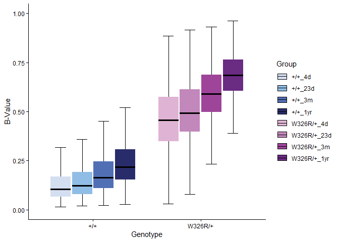<!-- -->

7.  Compute the *P-values* between ages per genotype - intestine

- wild-type mice

``` r
# Kruskal-Wallis for +/+
int.df.wt <- int.df[int.df$Geno == "+/+",]
  
kruskal.test(Value~Time, data = int.df.wt)
```

    ## 
    ##  Kruskal-Wallis rank sum test
    ## 
    ## data:  Value by Time
    ## Kruskal-Wallis chi-squared = 415.9, df = 3, p-value < 2.2e-16

``` r
pairwise.wilcox.test(int.df.wt$Value, int.df.wt$Time, p.adjust.methods = "BH")
```

    ## 
    ##  Pairwise comparisons using Wilcoxon rank sum test with continuity correction 
    ## 
    ## data:  int.df.wt$Value and int.df.wt$Time 
    ## 
    ##     1yr     23d     3m     
    ## 23d < 2e-16 -       -      
    ## 3m  2.7e-16 5.4e-16 -      
    ## 4d  < 2e-16 2.6e-05 < 2e-16
    ## 
    ## P value adjustment method: holm

- W326R/+ mice

``` r
# Kruskal-Wallis for W326R/+
int.df.mut <- int.df[int.df$Geno == "W326R/+",]
  
kruskal.test(Value~Time, data = int.df.mut)
```

    ## 
    ##  Kruskal-Wallis rank sum test
    ## 
    ## data:  Value by Time
    ## Kruskal-Wallis chi-squared = 750.81, df = 3, p-value < 2.2e-16

``` r
pairwise.wilcox.test(int.df.mut$Value, int.df.mut$Time, p.adjust.methods = "BH")
```

    ## 
    ##  Pairwise comparisons using Wilcoxon rank sum test with continuity correction 
    ## 
    ## data:  int.df.mut$Value and int.df.mut$Time 
    ## 
    ##     1yr     23d     3m     
    ## 23d < 2e-16 -       -      
    ## 3m  < 2e-16 < 2e-16 -      
    ## 4d  < 2e-16 8.1e-06 < 2e-16
    ## 
    ## P value adjustment method: holm

- Compute the *P-values* between genotypes (day 4)

``` r
# Two-sided, paired Wilcoxon rank sum test for +/+ versus W326R/+
day4.int <- subset(int.df, Time == "4d")
pairwise.wilcox.test(day4.int$Value, day4.int$Geno, p.adjust.methods = "BH")
```

    ## 
    ##  Pairwise comparisons using Wilcoxon rank sum test with continuity correction 
    ## 
    ## data:  day4.int$Value and day4.int$Geno 
    ## 
    ##         +/+   
    ## W326R/+ <2e-16
    ## 
    ## P value adjustment method: holm

<b><u> Bone marrow </u></b>

8.  Compute the mean DNA methylation per genotpye per time point (age) -
    bone marrow

``` r
# Compute mean beta values by age
bm$c.4d <- rowMeans(bm[,c(2:4)])
bm$c.23d <- rowMeans(bm[,c(5:7)])
bm$c.3m <- rowMeans(bm[,c(8:10)])
bm$c.1yr <- rowMeans(bm[,c(11:13)])
bm$m.4d <- rowMeans(bm[,c(14:16)])
bm$m.23d <- rowMeans(bm[,c(17:19)])
bm$m.3m <- rowMeans(bm[,c(20:22)])
bm$m.1yr <- rowMeans(bm[,c(23:25)])
```

9.  Convert the mean age data into a format suitable for ggplot - bone
    marrow

``` r
bm.df <- data.frame(Time = rep(c(rep("4d", length(bm[[1]])),
                             rep("23d", length(bm[[1]])),
                             rep("3m", length(bm[[1]])),
                             rep("1yr", length(bm[[1]]))),2),
                    Geno = c(rep("+/+",length(bm[[1]])*4),
                             rep("W326R/+",length(bm[[1]])*4)),
                    Value = c(bm$c.4d,
                              bm$c.23d,
                              bm$c.3m,
                              bm$c.1yr,
                              bm$m.4d,
                              bm$m.23d,
                              bm$m.3m,
                              bm$m.1yr))

bm.df$Group <- interaction(bm.df$Geno, bm.df$Time, sep = "_")
```

10. Order samples for plotting

``` r
group_levels_bm <- levels(factor(bm.df$Group))
group_levels_bm <- c(group_levels_bm[7],
                  group_levels_bm[3],
                  group_levels_bm[5],
                  group_levels_bm[1],
                  group_levels_bm[8],
                  group_levels_bm[4],
                  group_levels_bm[6],
                  group_levels_bm[2])
group_levels_bm
```

    ## [1] "+/+_4d"      "+/+_23d"     "+/+_3m"      "+/+_1yr"     "W326R/+_4d" 
    ## [6] "W326R/+_23d" "W326R/+_3m"  "W326R/+_1yr"

``` r
bm.df$Group <- factor(bm.df$Group, levels = group_levels_bm)
```

11. Plot heatmpap all individual samples - bone marrow

``` r
image(x=c(1:ncol(bm[,2:25])),y=c(1:nrow(bm)),
      z=t(bm[order(bm.ctrl$x), 2:25]),
      col=rev(brewer.pal(10,"RdYlBu")),breaks=seq(0,1,by=0.1),
      axes=FALSE,xlab="",ylab="gain DMRs (n=483)")
box()
mtext(colnames(bm[,2:25]), line=0.5, side=1, at=c(1:24),
      cex=0.6, las=2)
```

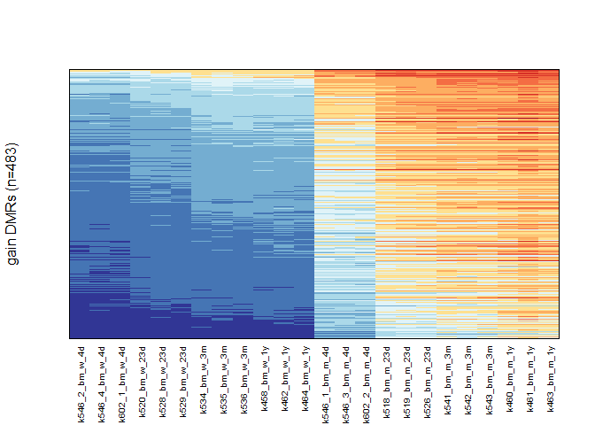<!-- -->

12. Plot boxplot for mean DNA methylation per age per genotype - bone
    marrow

``` r
ggplot(bm.df, aes(x = Geno, y = Value, fill = Group)) +
  stat_boxplot(
    position = position_dodge(0.8),
    geom = "errorbar",
    width = 0.4
  ) +
  geom_boxplot(position = position_dodge(width = 0.8), 
               colour = NA) +
  stat_summary(
    fun = median,
    geom = "crossbar",
    width = 0.75,
    colour = "black",
    position = position_dodge(0.8)
  ) +
  ylim(c(0,1))+
  scale_fill_manual(values = c(
    "+/+_4d" = "#d4def1",
    "+/+_23d" = "#90bde5",
    "+/+_3m" = "#516fb5",
    "+/+_1yr" = "#292c6a",
    "W326R/+_4d" = "#f7b0b2",
    "W326R/+_23d" = "#f17275",
    "W326R/+_3m" = "#ec2f2d",
    "W326R/+_1yr" = "#9c1d22"
  )) +
  labs(x = "Genotype", y = "B-Value", fill = "Group") +
  theme_classic()
```

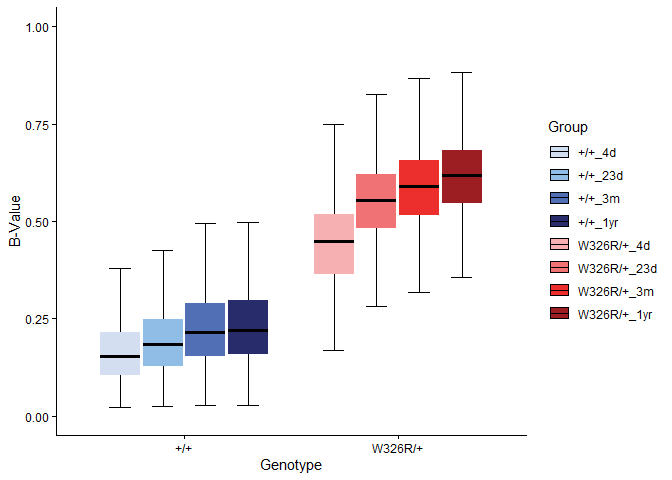<!-- -->

13. Compute the *P-values* between ages per genotype - bone marrow

- wild-type mice

``` r
# Kruskal-Wallis for +/+
bm.df.wt <- bm.df[bm.df$Geno == "+/+",]
  
kruskal.test(Value~Time, data = bm.df.wt)
```

    ## 
    ##  Kruskal-Wallis rank sum test
    ## 
    ## data:  Value by Time
    ## Kruskal-Wallis chi-squared = 136.24, df = 3, p-value < 2.2e-16

``` r
pairwise.wilcox.test(bm.df.wt$Value, bm.df.wt$Time, p.adjust.methods = "BH")
```

    ## 
    ##  Pairwise comparisons using Wilcoxon rank sum test with continuity correction 
    ## 
    ## data:  bm.df.wt$Value and bm.df.wt$Time 
    ## 
    ##     1yr     23d     3m     
    ## 23d 2.9e-08 -       -      
    ## 3m  0.31    4.7e-06 -      
    ## 4d  < 2e-16 1.4e-06 < 2e-16
    ## 
    ## P value adjustment method: holm

- W326R/+ mice

``` r
# Kruskal-Wallis for W326R/+
bm.df.mut <- bm.df[bm.df$Geno == "W326R/+",]
  
kruskal.test(Value~Time, data = bm.df.mut)
```

    ## 
    ##  Kruskal-Wallis rank sum test
    ## 
    ## data:  Value by Time
    ## Kruskal-Wallis chi-squared = 495.47, df = 3, p-value < 2.2e-16

``` r
pairwise.wilcox.test(bm.df.mut$Value, bm.df.mut$Time, p.adjust.methods = "BH")
```

    ## 
    ##  Pairwise comparisons using Wilcoxon rank sum test with continuity correction 
    ## 
    ## data:  bm.df.mut$Value and bm.df.mut$Time 
    ## 
    ##     1yr     23d     3m     
    ## 23d < 2e-16 -       -      
    ## 3m  1.6e-05 2.0e-06 -      
    ## 4d  < 2e-16 < 2e-16 < 2e-16
    ## 
    ## P value adjustment method: holm

- Compute the *P-values* between genotypes (day 4)

``` r
# Two-sided, paired Wilcoxon rank sum test for +/+ versus W326R/+
day4.bm <- subset(bm.df, Time == "4d")
pairwise.wilcox.test(day4.bm$Value, day4.bm$Geno, p.adjust.methods = "BH")
```

    ## 
    ##  Pairwise comparisons using Wilcoxon rank sum test with continuity correction 
    ## 
    ## data:  day4.bm$Value and day4.bm$Geno 
    ## 
    ##         +/+   
    ## W326R/+ <2e-16
    ## 
    ## P value adjustment method: holm

<b><u> Liver </u></b>

14. Convert the mean age data into a format suitable for ggplot - liver

``` r
li.df <- data.frame(Time = rep(c(rep("4d", length(li[[1]])),
                             rep("23d", length(li[[1]])),
                             rep("3m", length(li[[1]])),
                             rep("1yr", length(li[[1]]))),2),
                    Geno = c(rep("+/+",length(li[[1]])*4),
                             rep("W326R/+",length(li[[1]])*4)),
                    Value = c(li$c.4d,
                              li$c.23d,
                              li$c.3m,
                              li$c.1yr,
                              li$m.4d,
                              li$m.23d,
                              li$m.3m,
                              li$m.1yr))

li.df$Group <- interaction(li.df$Geno, li.df$Time, sep = "_")
```

15. Order samples for plotting

``` r
group_levels_li <- levels(factor(li.df$Group))
group_levels_li <- c(group_levels_li[7],
                  group_levels_li[3],
                  group_levels_li[5],
                  group_levels_li[1],
                  group_levels_li[8],
                  group_levels_li[4],
                  group_levels_li[6],
                  group_levels_li[2])
group_levels_li
```

    ## [1] "+/+_4d"      "+/+_23d"     "+/+_3m"      "+/+_1yr"     "W326R/+_4d" 
    ## [6] "W326R/+_23d" "W326R/+_3m"  "W326R/+_1yr"

``` r
li.df$Group <- factor(li.df$Group, levels = group_levels_li)
```

16. Plot heatmpap all individual samples - liver

``` r
image(x=c(1:ncol(li[,2:25])),y=c(1:nrow(li)),
      z=t(li[order(li.ctrl$x), 2:25]),
      col=rev(brewer.pal(10,"RdYlBu")),breaks=seq(0,1,by=0.1),
      axes=FALSE,xlab="",ylab="gain DMRs (n=257)")
box()
mtext(colnames(bm[,2:25]), line=0.5, side=1, at=c(1:24),
      cex=0.6, las=2)
```

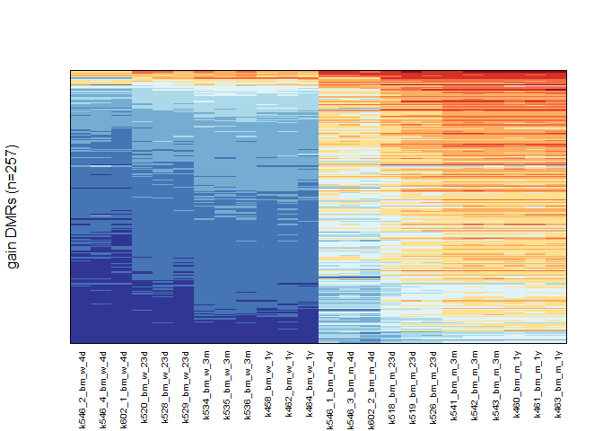<!-- -->

17. Plot boxplot for mean DNA methylation per age per genotype - liver

``` r
ggplot(li.df, aes(x = Geno, y = Value, fill = Group)) +
  stat_boxplot(
    position = position_dodge(0.8),
    geom = "errorbar",
    width = 0.4
  ) +
  geom_boxplot(position = position_dodge(width = 0.8), 
               colour = NA) +
  stat_summary(
    fun = median,
    geom = "crossbar",
    width = 0.75,
    colour = "black",
    position = position_dodge(0.8)
  ) +
  ylim(c(0,1))+
  scale_fill_manual(values = c(
    "+/+_4d" = "#d4def1",
    "+/+_23d" = "#90bde5",
    "+/+_3m" = "#516fb5",
    "+/+_1yr" = "#292c6a",
    "W326R/+_4d" = "#e0edd9",
    "W326R/+_23d" = "#add487",
    "W326R/+_3m" = "#1fb04b",
    "W326R/+_1yr" = "#0d6b37"
  )) +
  labs(x = "Genotype", y = "B-Value", fill = "Group") +
  theme_classic()
```

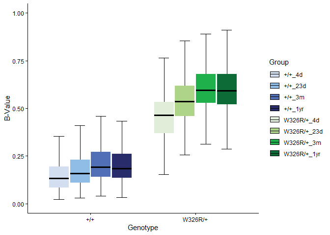<!-- -->

18. Compute the *P-values* between ages per genotype - liver

- wild-type mice

``` r
# Kruskal-Wallis for +/+
li.df.wt <- li.df[li.df$Geno == "+/+",]
  
kruskal.test(Value~Time, data = li.df.wt)
```

    ## 
    ##  Kruskal-Wallis rank sum test
    ## 
    ## data:  Value by Time
    ## Kruskal-Wallis chi-squared = 70.951, df = 3, p-value = 2.67e-15

``` r
pairwise.wilcox.test(li.df.wt$Value, li.df.wt$Time, p.adjust.methods = "BH")
```

    ## 
    ##  Pairwise comparisons using Wilcoxon rank sum test with continuity correction 
    ## 
    ## data:  li.df.wt$Value and li.df.wt$Time 
    ## 
    ##     1yr     23d     3m     
    ## 23d 0.00164 -       -      
    ## 3m  0.48524 0.00036 -      
    ## 4d  3.5e-11 0.00049 1.5e-12
    ## 
    ## P value adjustment method: holm

- W326R/+ mice

``` r
# Kruskal-Wallis for W326R/+
li.df.mut <- li.df[li.df$Geno == "W326R/+",]
  
kruskal.test(Value~Time, data = li.df.mut)
```

    ## 
    ##  Kruskal-Wallis rank sum test
    ## 
    ## data:  Value by Time
    ## Kruskal-Wallis chi-squared = 198.85, df = 3, p-value < 2.2e-16

``` r
pairwise.wilcox.test(li.df.mut$Value, li.df.mut$Time, p.adjust.methods = "BH")
```

    ## 
    ##  Pairwise comparisons using Wilcoxon rank sum test with continuity correction 
    ## 
    ## data:  li.df.mut$Value and li.df.mut$Time 
    ## 
    ##     1yr     23d     3m     
    ## 23d 2.4e-08 -       -      
    ## 3m  0.94    2.4e-08 -      
    ## 4d  < 2e-16 4.8e-12 < 2e-16
    ## 
    ## P value adjustment method: holm

- Compute the *P-values* between genotypes (day 4)

``` r
# Two-sided, paired Wilcoxon rank sum test for +/+ versus W326R/+
day4.li <- subset(li.df, Time == "4d")
pairwise.wilcox.test(day4.li$Value, day4.li$Geno, p.adjust.methods = "BH")
```

    ## 
    ##  Pairwise comparisons using Wilcoxon rank sum test with continuity correction 
    ## 
    ## data:  day4.li$Value and day4.li$Geno 
    ## 
    ##         +/+   
    ## W326R/+ <2e-16
    ## 
    ## P value adjustment method: holm

### EDF4.m,n

19. A function to plot fold change chromHMM summarised categories
    heatmap - CpGs at gained DMRs

``` r
# Function to plot heatmap of fold changes --------------------------------
plot_heatmap_fc <- function(data, cap) {
  
  data$fc_cap <- pmin(data$fold_change, cap)
  
  ggplot(data, aes(x = Tissue, y = reorder(Category, as.numeric(str_extract(Category, "\\d+"))), fill = fc_cap)) +
    geom_tile() +
    scale_fill_gradient(low = "white", high = "steelblue") +
    labs(x = "", y = "", fill = "Fold Change") +
    theme_bw() +
    theme(axis.text.x = element_text(angle = 90, hjust = 1))
}
```

20. Plot fold change heatmaps

- Intestine

``` r
# int
plot_heatmap_fc(int.11.cat, 125) # works with 'States' under y in plot_heatmap_fc
```

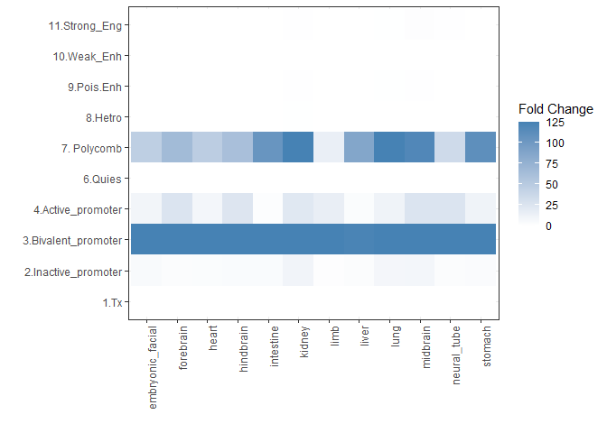<!-- -->

- Bone marrow

``` r
# bm
plot_heatmap_fc(bm.11.cat, 125) # works with 'States' under y in plot_heatmap_fc
```

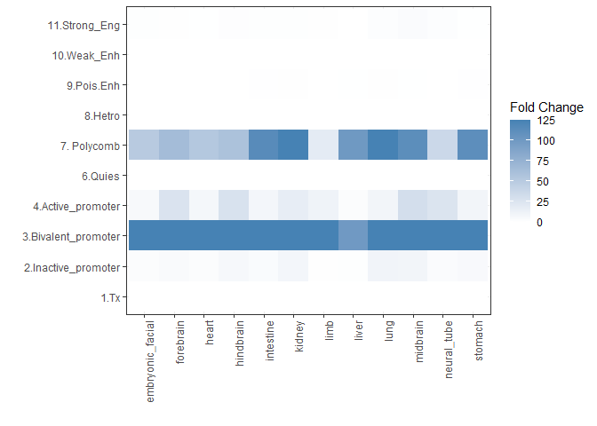<!-- -->

- Liver

``` r
# liv
plot_heatmap_fc(li.11.cat, 125) # works with 'States' under y in plot_heatmap_fc
```

<!-- -->

21. A function to plot total counts chromHMM summarised categories
    heatmap - CpGs at gained DMRs

``` r
### === Function to plot heatmap of total counts === ###
plot_heatmap_total_counts <- function(data, cap) {
  
  data$total_cap <- pmin(data$total_count, cap)
  
  ggplot(data, aes(x = Tissue, y = reorder(Category, as.numeric(str_extract(Category, "\\d+"))), fill = total_cap)) +
    geom_tile() +
    scale_fill_gradient(low = "white", high = "steelblue") +
    labs(x = "", y = "", fill = "Total counts") +
    theme_bw() +
    theme(axis.text.x = element_text(angle = 90, hjust = 1))
}
```

22. Plot - total count bead array

``` r
plot_heatmap_total_counts(int.11.cat,2e+06)
```

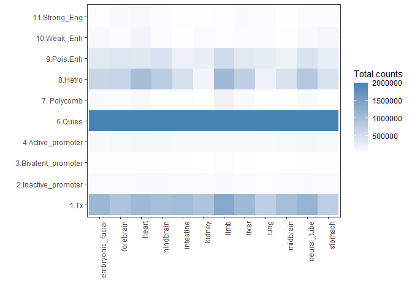<!-- -->

### EDF4.o

23. Keep the order for plotting

``` r
int.anno$Feature <- factor(int.anno$Feature, levels = int.anno$Feature)
bm.anno$Feature <- factor(bm.anno$Feature, levels = bm.anno$Feature)
li.anno$Feature <- factor(li.anno$Feature, levels = li.anno$Feature)

total_mm10_array$Feature <- factor(total_mm10_array$Feature, levels = total_mm10_array$Feature)
```

24. A funciton to plot genomic annotations percentages

``` r
# Function to plot annotations bar chart --------------------------------
plot_anno_bar <- function(data, name) {

plot_anno <- ggplot(data, aes(x = factor(1), y = perc, fill = Feature))+
                  geom_col(position = "stack", width = 0.5)+
                  coord_flip()+
                  scale_fill_manual(values = c("#591C19FF", "#9B332BFF", "#B64F32FF", "#D39e2eFF", "#F7d267ff", "#f7C267bb","#B9B9B8FF", "#8B8B99FF", "#41485FFF", "#262D42FF"))+
                  labs(x = "",
                       y = "Percentage (%)",
                       title = name)+
                  theme_bw()

plot_anno
}
```

25. Plot genomic annotations

- Intestine

``` r
plot_anno_bar(int.anno, "Gain DMR-CpG intestine")
```

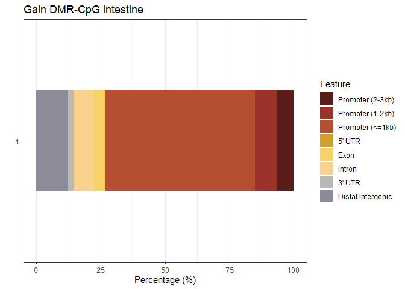<!-- -->

- Bone marrow

``` r
plot_anno_bar(bm.anno, "Gain DMR-CpG bone marrow")
```

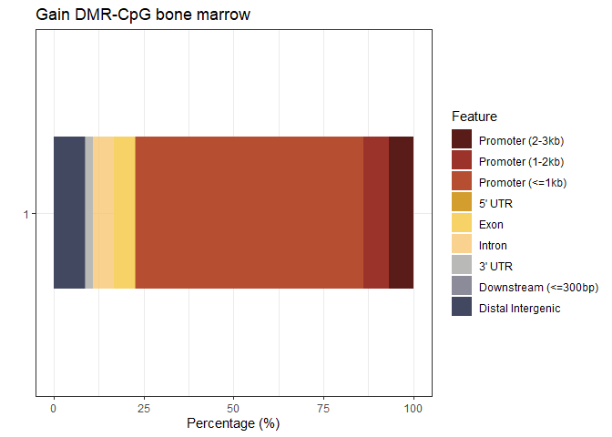<!-- -->

- Liver

``` r
plot_anno_bar(li.anno, "Gain DMR-CpG liver")
```

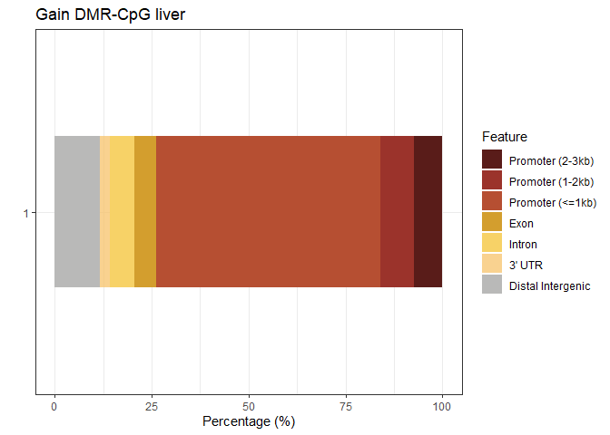<!-- -->

- Plot total CpG array

``` r
plot_anno_bar(total_mm10_array, "Total CpG array")
```

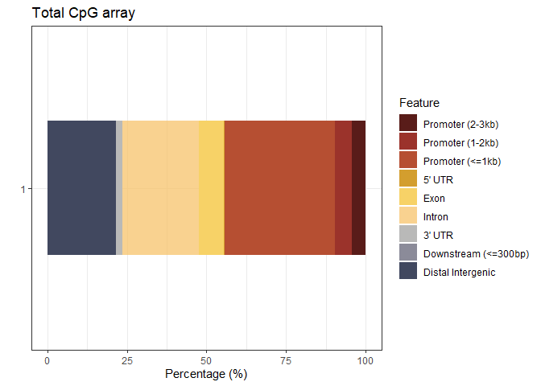<!-- -->

``` r
sessionInfo()
```

    ## R version 4.5.0 (2025-04-11 ucrt)
    ## Platform: x86_64-w64-mingw32/x64
    ## Running under: Windows 11 x64 (build 26100)
    ## 
    ## Matrix products: default
    ##   LAPACK version 3.12.1
    ## 
    ## locale:
    ## [1] LC_COLLATE=English_United Kingdom.utf8 
    ## [2] LC_CTYPE=English_United Kingdom.utf8   
    ## [3] LC_MONETARY=English_United Kingdom.utf8
    ## [4] LC_NUMERIC=C                           
    ## [5] LC_TIME=English_United Kingdom.utf8    
    ## 
    ## time zone: Europe/London
    ## tzcode source: internal
    ## 
    ## attached base packages:
    ## [1] stats     graphics  grDevices utils     datasets  methods   base     
    ## 
    ## other attached packages:
    ## [1] tidyr_1.3.2        stringr_1.6.0      RColorBrewer_1.1-3 ggplot2_4.0.2     
    ## [5] dplyr_1.2.0       
    ## 
    ## loaded via a namespace (and not attached):
    ##  [1] vctrs_0.7.2       cli_3.6.5         knitr_1.51        rlang_1.1.7      
    ##  [5] xfun_0.57         stringi_1.8.7     otel_0.2.0        purrr_1.2.1      
    ##  [9] generics_0.1.4    S7_0.2.1          labeling_0.4.3    glue_1.8.0       
    ## [13] htmltools_0.5.9   scales_1.4.0      rmarkdown_2.31    grid_4.5.0       
    ## [17] evaluate_1.0.5    tibble_3.3.1      fastmap_1.2.0     yaml_2.3.12      
    ## [21] lifecycle_1.0.5   compiler_4.5.0    pkgconfig_2.0.3   rstudioapi_0.18.0
    ## [25] farver_2.1.2      digest_0.6.39     R6_2.6.1          tidyselect_1.2.1 
    ## [29] pillar_1.11.1     magrittr_2.0.4    withr_3.0.2       tools_4.5.0      
    ## [33] gtable_0.3.6
