Sarni et al., Extended Data Figure 6
================
dsarni
03-03-2026

## Extended Data Figure 6. Hypermethylation at Polycomb-associated regions in Dnmt3a W326R/+ mouse adult stem cells

1.  Libraries used in this figure.

``` r
library(dplyr)
library(ggplot2)
library(readr)
library(stringr)
library(RColorBrewer)
```

2.  Import data.

``` r
# EDF6.a,b
hsc_chrmhmm <- read.csv("../data/EDF6/hsc_chromHMM.csv")

# EDF6.c
hsc_anno <- read.csv("../data/EDF6/hsc_Anno_peak_summary.csv")
hsc_anno_all <- read.csv("../data/EDF6/hsc_all_Anno_peak_summary.csv")

# EDF6.d
hsc_go <- read.table("../data/EDF6/HSC_Up_DMRs_all_GOSemSim_table_261125.txt", sep = '\t')

# EDF6.g
bin.1mb.cov10.narm <- read_tsv("../data/EDF6/hsc_bin_1mb_cov10_narm.tsv.gz")
```

    ## Rows: 2413 Columns: 12
    ## ── Column specification ────────────────────────────────────────────────────────
    ## Delimiter: "\t"
    ## chr (3): chrom, sign, sign.fc
    ## dbl (9): bin_start, bin_end, mean_cond1, mean_cond2, coverage, pval, pval_ad...
    ## 
    ## ℹ Use `spec()` to retrieve the full column specification for this data.
    ## ℹ Specify the column types or set `show_col_types = FALSE` to quiet this message.

``` r
bin.100kb.cov10.narm <- read_tsv("../data/EDF6/hsc_bin_100kb_cov10_narm.tsv.gz")
```

    ## Rows: 23971 Columns: 12
    ## ── Column specification ────────────────────────────────────────────────────────
    ## Delimiter: "\t"
    ## chr (3): chrom, sign, sign.fc
    ## dbl (9): bin_start, bin_end, mean_cond1, mean_cond2, coverage, pval, pval_ad...
    ## 
    ## ℹ Use `spec()` to retrieve the full column specification for this data.
    ## ℹ Specify the column types or set `show_col_types = FALSE` to quiet this message.

``` r
bin.10kb.cov10.narm <- read_tsv("../data/EDF6/hsc_bin_10kb_cov10_narm.tsv.gz")
```

    ## Rows: 237972 Columns: 12
    ## ── Column specification ────────────────────────────────────────────────────────
    ## Delimiter: "\t"
    ## chr (3): chrom, sign, sign.fc
    ## dbl (9): bin_start, bin_end, mean_cond1, mean_cond2, coverage, pval, pval_ad...
    ## 
    ## ℹ Use `spec()` to retrieve the full column specification for this data.
    ## ℹ Specify the column types or set `show_col_types = FALSE` to quiet this message.

``` r
bin.1kb.cov10.narm <- read_tsv("../data/EDF6/hsc_bin_1kb_cov10_narm.tsv.gz")
```

    ## Rows: 658996 Columns: 12
    ## ── Column specification ────────────────────────────────────────────────────────
    ## Delimiter: "\t"
    ## chr (3): chrom, sign, sign.fc
    ## dbl (9): bin_start, bin_end, mean_cond1, mean_cond2, coverage, pval, pval_ad...
    ## 
    ## ℹ Use `spec()` to retrieve the full column specification for this data.
    ## ℹ Specify the column types or set `show_col_types = FALSE` to quiet this message.

``` r
bin.1bp.cov10.narm <- read_tsv("../data/EDF6/hsc_bin_1bp_cov5.tsv.gz")
```

    ## Rows: 3298426 Columns: 11
    ## ── Column specification ────────────────────────────────────────────────────────
    ## Delimiter: "\t"
    ## chr (3): chr, cg.id, sign
    ## dbl (8): V1, start, end, wt.mean, mut.mean, dml, delta, fc
    ## 
    ## ℹ Use `spec()` to retrieve the full column specification for this data.
    ## ℹ Specify the column types or set `show_col_types = FALSE` to quiet this message.

### EDF6.a,b

3.  A function to plot heatmap fold change - HSC chromHMM states

``` r
# Function to plot heatmap of fold changes
plot_heatmap_fc <- function(data, cap) {
  
  data$fc_cap <- pmin(data$fold_change, cap)
  
  ggplot(data, aes(x = table, y = reorder(state, as.numeric(str_extract(state, "\\d+"))), fill = fc_cap)) +
    geom_tile() +
    scale_fill_gradient(low = "white", high = "steelblue") +
    labs(x = "", y = "", fill = "Fold Change") +
    theme_bw() +
    theme(axis.text.x = element_text(angle = 90, hjust = 1))
}
```

4.  Plot HSC CpG in gain DMRs fold change

``` r
plot_heatmap_fc(hsc_chrmhmm, 250)
```

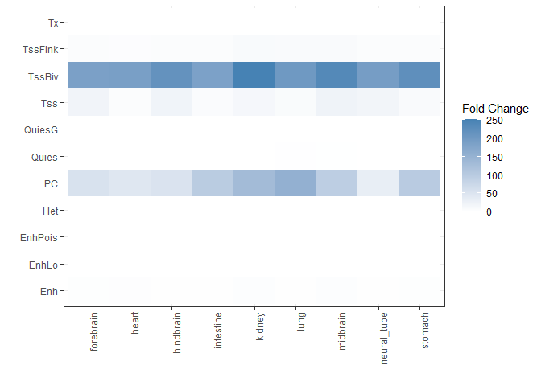<!-- --> 5. A function
to plot heatmap of total CpGs

``` r
# Function to plot heatmap of total counts
plot_heatmap_total_counts <- function(data, cap) {
  
  data$total_cap <- pmin(data$total_percentage, cap)
  
  ggplot(data, aes(x = table, y = reorder(state, as.numeric(str_extract(state, "\\d+"))), fill = total_cap)) +
    geom_tile() +
    scale_fill_gradient(low = "white", high = "steelblue") +
    labs(x = "", y = "", fill = "Total counts") +
    theme_bw() +
    theme(axis.text.x = element_text(angle = 90, hjust = 1))
}
```

6.  Plot HSC - total CpG count

``` r
plot_heatmap_total_counts(hsc_chrmhmm, 0.001)
```

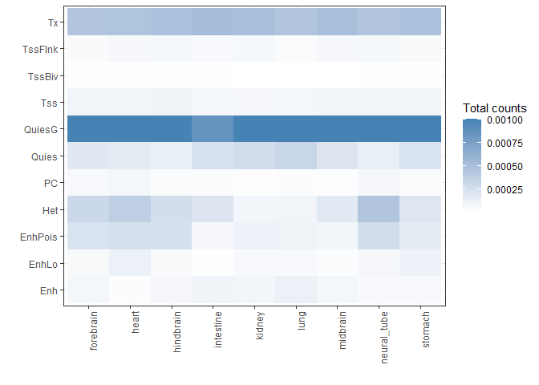<!-- -->

### EDF6.c

7.  Keep the order for plotting genomic annotations

``` r
hsc_anno$Feature <- factor(hsc_anno$Feature, levels = hsc_anno$Feature)
hsc_anno_all$Feature <- factor(hsc_anno_all$Feature, levels = hsc_anno_all$Feature)
```

8.  A function to plot genomic annotations percentages

``` r
# Function to plot annotations bar chart
plot_anno_bar <- function(data, name) {

plot_anno <- ggplot(data, aes(x = factor(1), y = perc, fill = Feature))+
                  geom_col(position = "stack", width = 0.5)+
                  coord_flip()+
                  scale_fill_manual(values = c("#591C19FF", "#9B332BFF", "#B64F32FF", "#D39e2eFF", "#F7d267ff", "#f7C267bb","#B9B9B8FF", "#8B8B99FF", "#41485FFF", "#262D42FF"))+
                  labs(x = "",
                       y = "Percentage (%)",
                       title = name)+
                  theme_bw()

plot_anno
}
```

9.  Plot genomic annotations - HSCs CpGs in gain DMRs

``` r
plot_anno_bar(hsc_anno, "Gain DMR-CpG HSC")
```

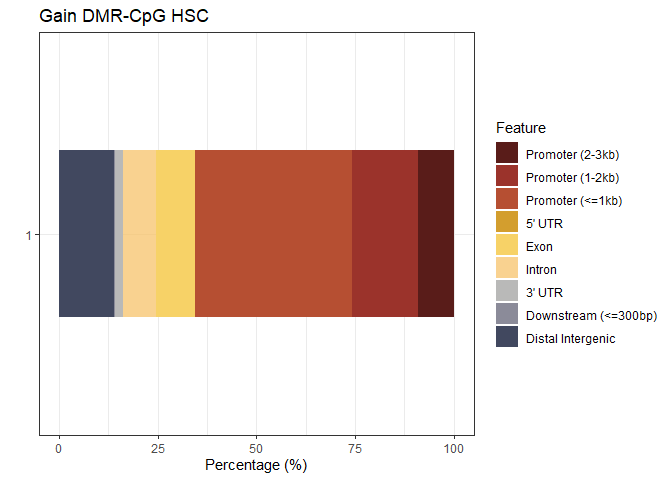<!-- -->

10. Plot genomic annotations - HSCs total CpGs

``` r
plot_anno_bar(hsc_anno_all, "Total CpG count - HSC")
```

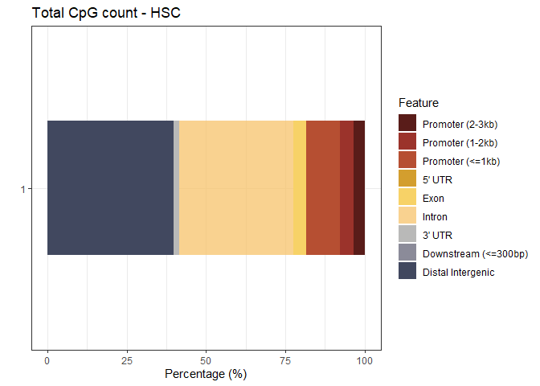<!-- -->

### EDF6.d

11. Color scheme

``` r
col.pal.base.1 <-c("#FFFFBF", "#D53E4F")
col.pal.base.2 <-c("#FFFFBF", "#5E4FA2")
col.func.1 <- colorRampPalette(col.pal.base.1)
col.func.2 <- colorRampPalette(col.pal.base.2)

log10padj.col <- c(rev(col.func.2(50)), col.func.1(50))
```

``` r
hsc_go_top5 <- head(hsc_go, n=5)
hsc_go_top5$log10.padj.up <- -log(hsc_go_top5$padj.up, base=10)
hsc_go_top5 <- hsc_go_top5[order(hsc_go_top5$log10.padj.up),]
```

``` r
breaks_hsc_go_top5 <- seq(from=min(hsc_go_top5$log10.padj.up), to=max(hsc_go_top5$log10.padj.up), by=(max(hsc_go_top5$log10.padj.up)-min(hsc_go_top5$log10.padj.up))/100)

bin_hsc_go <- cut(hsc_go_top5$log10.padj.up, breaks=breaks_hsc_go_top5, include.lowest = TRUE)
levels(bin_hsc_go) <- c(1:100)
bin_hsc_go <- as.vector(bin_hsc_go, mode="numeric")
```

12. Plot HSC GO enrichment, top 5 terms

``` r
midpoints <- barplot(height=hsc_go_top5$per.fc.up,
                     space=0, yaxs="i", col=log10padj.col[bin_hsc_go],
                     horiz=TRUE, xlim=c(0, 1.04*max(hsc_go_top5$per.fc.up)), xaxs="i", xlab="% Enrichment vs All Probes")
box()
mtext(text=paste(rownames(hsc_go_top5), hsc_go_top5$description, sep="\n"),
      at=c(midpoints), side=2, las=2, cex=0.6, line=0.5)
```

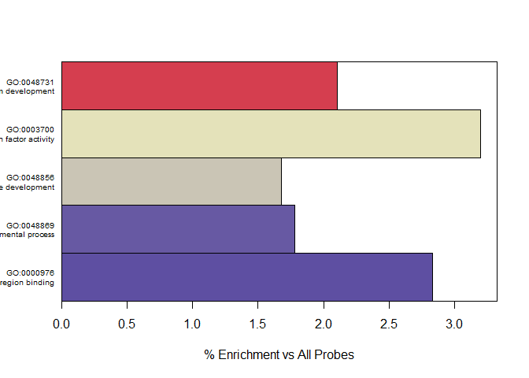<!-- -->

### EDF6.g

13. Plot

13.1. 1Mb bin size

- Scatter plot

``` r
p.scat.color.1mb.fc <- ggplot(data = bin.1mb.cov10.narm, aes(x = mean_cond1, y = mean_cond2, color = sign.fc))+
  ggrastr::rasterise(geom_point(size = 0.9, alpha = 0.7))+
  scale_color_manual(values = c("No-change"="grey","Gain"="firebrick2", "Loss"="blue")) +
  scale_x_continuous(limits = c(0, 100), expand = c(0, 0)) +
  scale_y_continuous(limits = c(0, 100), expand = c(0, 0)) +
  labs(x = "+/+ mean DNA methylation (%)",
       y = "W326R/+ mean DNA methylation (%)")+
  theme_bw(base_size = 14) +
  theme(
    panel.grid = element_blank(),
    panel.border = element_rect(color = "black", fill = NA,),
    legend.title = element_blank()
  )
p.scat.color.1mb.fc.v2 <- p.scat.color.1mb.fc+
  annotate("text", x = 5, y = 95,
           label = "n = 89", color = "red",
           hjust = 0, vjust = 1, size = 5) +
  annotate("text", x = 80, y = 10,
           label = "n = 0", color = "blue",
           hjust = 0, vjust = 1, size = 5) 
p.scat.color.1mb.fc.v2
```

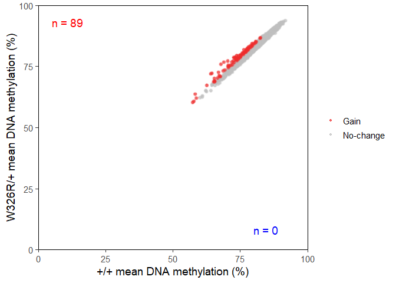<!-- -->

- Density plot

``` r
smoothScatter(bin.1mb.cov10.narm[[4]], bin.1mb.cov10.narm[[5]], nrpoints=0, xlim=c(0,100), ylim = c(0,100),
              #nrpoints = 100, 
              xlab = "+/+ DNA methylation (%)",
              ylab = "W326R/+ DNA methylation (%)",
              panel.first = {rect(0, 0, 100, 100, col = "#092F68", border = NA)},
              colramp = colorRampPalette(c("#092F68",
                                           "#66B2FF",
                                           "#99FFFF",
                                           "#99FF99", 
                                           "#FFFF66",
                                           "#FFFF00", 
                                           "#FFB266", 
                                           "#FF8000",
                                           "#FF6666", 
                                           "#FF0000", 
                                           "#330000")))
```

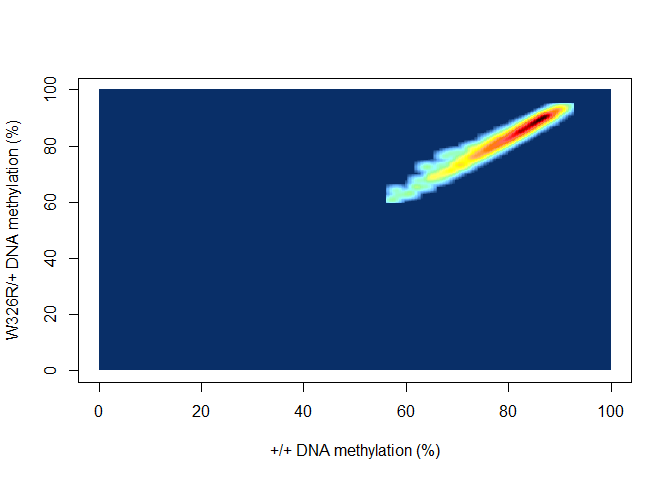<!-- -->

13.2. 100kb bin size

- Scatter plot

``` r
p.scat.color.100kb.fc <- ggplot(data = bin.100kb.cov10.narm, aes(x = mean_cond1, y = mean_cond2, color = sign.fc))+
  ggrastr::rasterise(geom_point(size = 0.9, alpha = 0.7))+
  scale_color_manual(values = c("No-change"="grey","Gain"="firebrick2", "Loss"="blue")) +
  scale_x_continuous(limits = c(0, 100), expand = c(0, 0)) +
  scale_y_continuous(limits = c(0, 100), expand = c(0, 0)) +
  labs(x = "+/+ mean DNA methylation (%)",
       y = "W326R/+ mean DNA methylation (%)")+
  theme_bw(base_size = 14) +
  theme(
    panel.grid = element_blank(),
    panel.border = element_rect(color = "black", fill = NA,),
    legend.title = element_blank()
  )
p.scat.color.100kb.fc.v2 <- p.scat.color.100kb.fc+
  annotate("text", x = 5, y = 95,
           label = "n = 326", color = "red",
           hjust = 0, vjust = 1, size = 5) +
  annotate("text", x = 80, y = 10,
           label = "n = 0", color = "blue",
           hjust = 0, vjust = 1, size = 5) 
p.scat.color.100kb.fc.v2
```

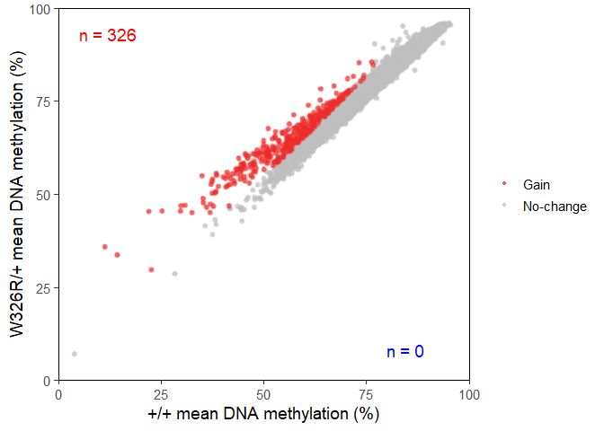<!-- -->

- Density plot

``` r
smoothScatter(bin.100kb.cov10.narm[[4]], bin.100kb.cov10.narm[[5]], nrpoints=0, xlim=c(0,100), ylim = c(0,100),
              xlab = "+/+ DNA methylation (%)",
              ylab = "W326R/+ DNA methylation (%)",
              panel.first = {rect(0, 0, 100, 100, col = "#092F68", border = NA)},
              colramp = colorRampPalette(c("#092F68",
                                           "#66B2FF",
                                           "#99FFFF",
                                           "#99FF99", 
                                           "#FFFF66",
                                           "#FFFF00", 
                                           "#FFB266", 
                                           "#FF8000",
                                           "#FF6666", 
                                           "#FF0000", 
                                           "#330000")))
```

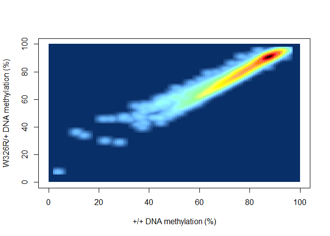<!-- -->

13.3. 10kb bin size

- Scatter plot

``` r
p.scat.color.10kb.fc <- ggplot(data = bin.10kb.cov10.narm, aes(x = mean_cond1, y = mean_cond2, color = sign.fc))+
  ggrastr::rasterise(geom_point(size = 0.9, alpha = 0.7))+
  scale_color_manual(values = c("No-change"="grey","Gain"="firebrick2", "Loss"="blue")) +
  scale_x_continuous(limits = c(0, 100), expand = c(0, 0)) +
  scale_y_continuous(limits = c(0, 100), expand = c(0, 0)) +
  labs(x = "+/+ mean DNA methylation (%)",
       y = "W326R/+ mean DNA methylation (%)")+
  theme_bw(base_size = 14) +
  theme(
    panel.grid = element_blank(),
    panel.border = element_rect(color = "black", fill = NA,),
    legend.title = element_blank()
  )
p.scat.color.10kb.fc.v2 <- p.scat.color.10kb.fc+
  annotate("text", x = 5, y = 95,
           label = "n = 561", color = "red",
           hjust = 0, vjust = 1, size = 5) +
  annotate("text", x = 80, y = 10,
           label = "n = 2", color = "blue",
           hjust = 0, vjust = 1, size = 5) 
p.scat.color.10kb.fc.v2
```

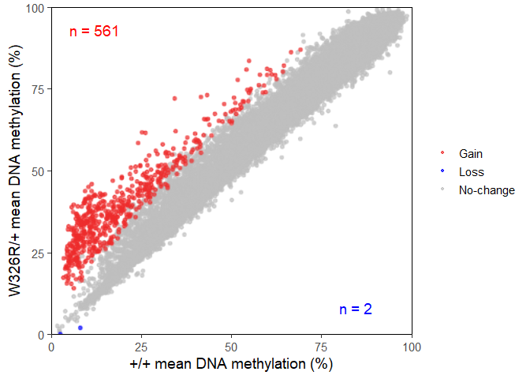<!-- -->

- Density plot

``` r
smoothScatter(bin.10kb.cov10.narm[[4]], bin.10kb.cov10.narm[[5]], nrpoints=0, xlim=c(0,100), ylim = c(0,100),
              xlab = "+/+ DNA methylation (%)",
              ylab = "W326R/+ DNA methylation (%)",
              panel.first = {rect(0, 0, 100, 100, col = "#092F68", border = NA)},
              colramp = colorRampPalette(c("#092F68",
                                           "#66B2FF",
                                           "#99FFFF",
                                           "#99FF99", 
                                           "#FFFF66",
                                           "#FFFF00", 
                                           "#FFB266", 
                                           "#FF8000",
                                           "#FF6666", 
                                           "#FF0000", 
                                           "#330000")))
```

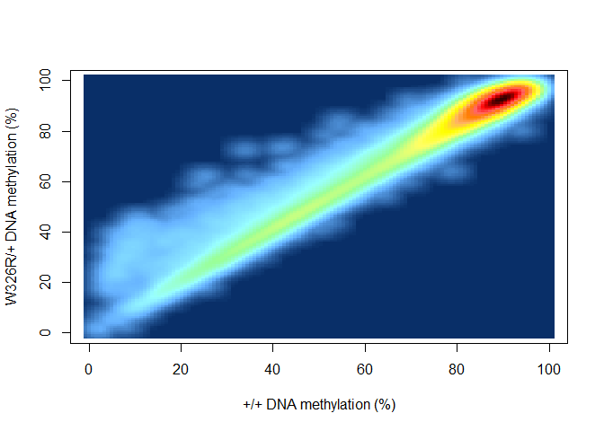<!-- -->

13.4. 1kb bin size

- Scatter plot

``` r
p.scat.color.1kb.fc <- ggplot(data = bin.1kb.cov10.narm, aes(x = mean_cond1, y = mean_cond2, color = sign.fc))+
  ggrastr::rasterise(geom_point(size = 0.9, alpha = 0.7))+
  scale_color_manual(values = c("No-change"="grey","Gain"="firebrick2", "Loss"="blue")) +
  scale_x_continuous(limits = c(0, 100), expand = c(0, 0)) +
  scale_y_continuous(limits = c(0, 100), expand = c(0, 0)) +
  labs(x = "+/+ mean DNA methylation (%)",
       y = "W326R/+ mean DNA methylation (%)")+
  theme_bw(base_size = 14) +
  theme(
    panel.grid = element_blank(),
    panel.border = element_rect(color = "black", fill = NA,),
    legend.title = element_blank()
  )
p.scat.color.1kb.fc.v2 <- p.scat.color.1kb.fc+
  annotate("text", x = 5, y = 95,
           label = "n = 1,487", color = "red",
           hjust = 0, vjust = 1, size = 5) +
  annotate("text", x = 80, y = 10,
           label = "n = 0", color = "blue",
           hjust = 0, vjust = 1, size = 5) 
p.scat.color.1kb.fc.v2
```

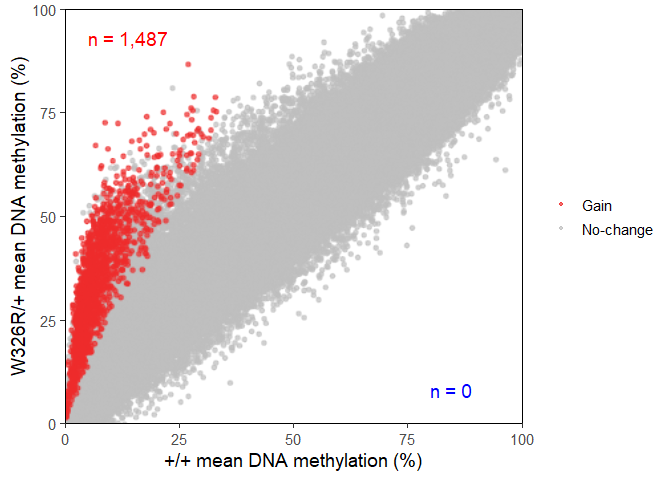<!-- -->

- Density plot

``` r
smoothScatter(bin.1kb.cov10.narm[[4]], bin.1kb.cov10.narm[[5]], nrpoints=0, xlim=c(0,100), ylim = c(0,100),
              xlab = "+/+ DNA methylation (%)",
              ylab = "W326R/+ DNA methylation (%)",
              panel.first = {rect(0, 0, 100, 100, col = "#092F68", border = NA)},
              colramp = colorRampPalette(c("#092F68",
                                           "#66B2FF",
                                           "#99FFFF",
                                           "#99FF99", 
                                           "#FFFF66",
                                           "#FFFF00", 
                                           "#FFB266", 
                                           "#FF8000",
                                           "#FF6666", 
                                           "#FF0000", 
                                           "#330000")))
```

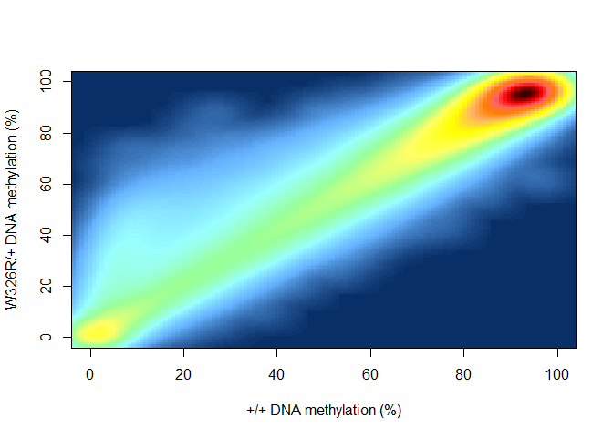<!-- -->

13.5. 1bp bin size

- Scatter plot

``` r
p.scat.color.1bp <- ggplot(data = bin.1bp.cov10.narm, aes(x = wt.mean, y = mut.mean, color = sign))+
  ggrastr::rasterise(geom_point(size = 0.9, alpha = 0.7))+
  scale_color_manual(values = c("No-change"="grey","Gain"="firebrick2", "Loss"="blue")) +
  scale_x_continuous(limits = c(0, 100), expand = c(0, 0)) +
  scale_y_continuous(limits = c(0, 100), expand = c(0, 0)) +
  labs(x = "+/+ mean DNA methylation (%)",
       y = "W326R/+ mean DNA methylation (%)")+
  theme_bw(base_size = 14) +
  theme(
    panel.grid = element_blank(),
    panel.border = element_rect(color = "black", fill = NA,),
    legend.title = element_blank()
  )
p.scat.color.1bp.v2 <- p.scat.color.1bp+
  annotate("text", x = 5, y = 95,
           label = "n = 12,023", color = "red",
           hjust = 0, vjust = 1, size = 5) +
  annotate("text", x = 80, y = 10,
           label = "n = 182", color = "blue",
           hjust = 0, vjust = 1, size = 5) 
p.scat.color.1bp.v2
```

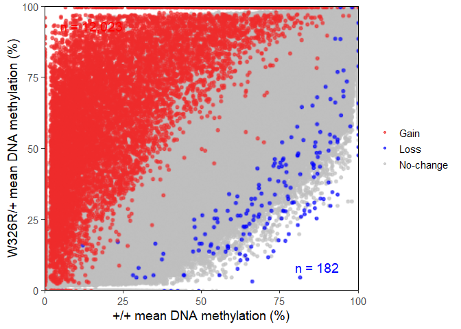<!-- -->

- Density plot

``` r
smoothScatter(bin.1bp.cov10.narm[[5]], bin.1bp.cov10.narm[[6]], nrpoints=0, xlim=c(0,100), ylim = c(0,100),
              xlab = "+/+ DNA methylation (%)",
              ylab = "W326R/+ DNA methylation (%)",
              panel.first = {rect(0, 0, 100, 100, col = "#092F68", border = NA)},
              colramp = colorRampPalette(c("#092F68",
                                           "#66B2FF",
                                           "#99FFFF",
                                           "#99FF99", 
                                           "#FFFF66",
                                           "#FFFF00", 
                                           "#FFB266", 
                                           "#FF8000",
                                           "#FF6666", 
                                           "#FF0000", 
                                           "#330000")))
```

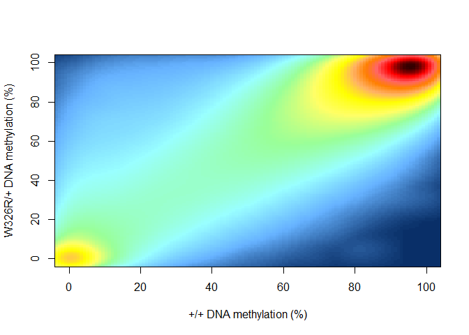<!-- -->

``` r
sessionInfo()
```

    ## R version 4.5.0 (2025-04-11 ucrt)
    ## Platform: x86_64-w64-mingw32/x64
    ## Running under: Windows 11 x64 (build 26100)
    ## 
    ## Matrix products: default
    ##   LAPACK version 3.12.1
    ## 
    ## locale:
    ## [1] LC_COLLATE=English_United Kingdom.utf8 
    ## [2] LC_CTYPE=English_United Kingdom.utf8   
    ## [3] LC_MONETARY=English_United Kingdom.utf8
    ## [4] LC_NUMERIC=C                           
    ## [5] LC_TIME=English_United Kingdom.utf8    
    ## 
    ## time zone: Europe/London
    ## tzcode source: internal
    ## 
    ## attached base packages:
    ## [1] stats     graphics  grDevices utils     datasets  methods   base     
    ## 
    ## other attached packages:
    ## [1] RColorBrewer_1.1-3 stringr_1.5.1      readr_2.1.5        ggplot2_3.5.2     
    ## [5] dplyr_1.1.4       
    ## 
    ## loaded via a namespace (and not attached):
    ##  [1] bit_4.6.0          gtable_0.3.6       compiler_4.5.0     crayon_1.5.3      
    ##  [5] tidyselect_1.2.1   ggbeeswarm_0.7.2   parallel_4.5.0     scales_1.4.0      
    ##  [9] yaml_2.3.10        fastmap_1.2.0      R6_2.6.1           labeling_0.4.3    
    ## [13] generics_0.1.4     knitr_1.50         Cairo_1.7-0        tibble_3.3.0      
    ## [17] pillar_1.11.0      tzdb_0.5.0         rlang_1.1.6        stringi_1.8.7     
    ## [21] xfun_0.52          bit64_4.6.0-1      cli_3.6.5          withr_3.0.2       
    ## [25] magrittr_2.0.3     digest_0.6.37      grid_4.5.0         vroom_1.6.5       
    ## [29] rstudioapi_0.17.1  hms_1.1.3          beeswarm_0.4.0     lifecycle_1.0.4   
    ## [33] vipor_0.4.7        ggrastr_1.0.2      vctrs_0.6.5        KernSmooth_2.23-26
    ## [37] evaluate_1.0.4     glue_1.8.0         farver_2.1.2       rmarkdown_2.29    
    ## [41] tools_4.5.0        pkgconfig_2.0.3    htmltools_0.5.8.1
