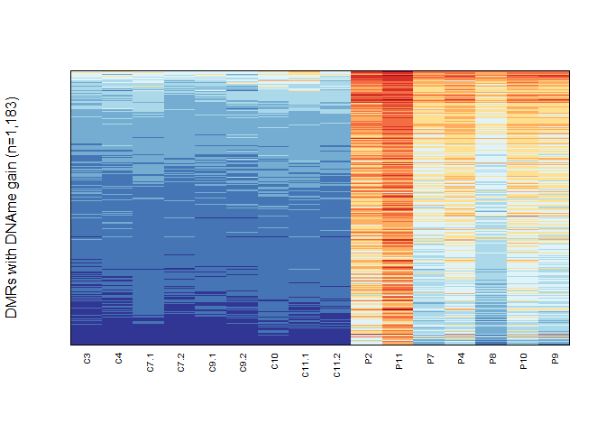
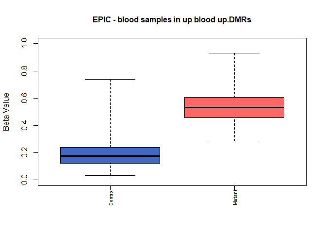

Sarni et al., Figure 1
================
dsarni
22-02-2026

## Figure 1. HESJAS syndrome

1.  Library used for this figure.

``` r
library(RColorBrewer)
```

2.  Import data - DNA methylation in control and HESJAS patients within
    DNA hypermethylated DMRs.

Input data for this figure will be processed and normalised beta values
for CpGs within HESJAS hypermethylated DMRs.

``` r
# Import data table

hDMR_blood_beta <- read.csv("../data/Figure_1/Figure_1ef_hesjas_gain_dmr_meth.csv")
```

3.  Compute the mean for control samples to be used for ordering the
    rows in the heatmap.

``` r
hDMR_blood_beta.mean.ctrl <- apply(hDMR_blood_beta[,c(2:10)], 1, mean, na.rm=TRUE)
```

### Figure 1.e

``` r
image(x=c(1:ncol(hDMR_blood_beta[,2:17])),y=c(1:nrow(hDMR_blood_beta)),
      z=t(hDMR_blood_beta[order(hDMR_blood_beta.mean.ctrl), 2:17]),
      col=rev(brewer.pal(10,"RdYlBu")),breaks=seq(0,1,by=0.1),
      axes=FALSE,xlab="",ylab="DMRs with DNAme gain (n=1,183)")
box()
mtext(colnames(hDMR_blood_beta[,2:17]), line=0.5, side=1, at=c(1:16),
      cex=0.6, las=2)
```

<!-- -->

### Figure 1.f

``` r
# For boxplots plot the mean beta values (DNA methylation) per condition, columns 18:19 in the data table

boxplot(hDMR_blood_beta[,18:19],
        names=rep("", times=2), range=0, ylim=c(0,1), col = c(("#4169C4"),("#FF6666")),
        ylab="Beta Value", cex.main=1, main="EPIC - blood samples in up blood up.DMRs")
mtext(colnames(hDMR_blood_beta)[18:19], line=0.5, side=1, at=c(1:2),
      cex=0.6, las=2)
```

<!-- -->

4.  Compute the *P-value* for Figure 1.f using Wilcox.test.

``` r
wilcox.test(hDMR_blood_beta[,18],hDMR_blood_beta[,19])
```

    ## 
    ##  Wilcoxon rank sum test with continuity correction
    ## 
    ## data:  hDMR_blood_beta[, 18] and hDMR_blood_beta[, 19]
    ## W = 14226, p-value < 2.2e-16
    ## alternative hypothesis: true location shift is not equal to 0

``` r
sessionInfo()
```

    ## R version 4.5.0 (2025-04-11 ucrt)
    ## Platform: x86_64-w64-mingw32/x64
    ## Running under: Windows 11 x64 (build 26100)
    ## 
    ## Matrix products: default
    ##   LAPACK version 3.12.1
    ## 
    ## locale:
    ## [1] LC_COLLATE=English_United Kingdom.utf8 
    ## [2] LC_CTYPE=English_United Kingdom.utf8   
    ## [3] LC_MONETARY=English_United Kingdom.utf8
    ## [4] LC_NUMERIC=C                           
    ## [5] LC_TIME=English_United Kingdom.utf8    
    ## 
    ## time zone: Europe/London
    ## tzcode source: internal
    ## 
    ## attached base packages:
    ## [1] stats     graphics  grDevices utils     datasets  methods   base     
    ## 
    ## other attached packages:
    ## [1] RColorBrewer_1.1-3
    ## 
    ## loaded via a namespace (and not attached):
    ##  [1] compiler_4.5.0    fastmap_1.2.0     cli_3.6.5         tools_4.5.0      
    ##  [5] htmltools_0.5.9   otel_0.2.0        rstudioapi_0.18.0 yaml_2.3.12      
    ##  [9] rmarkdown_2.31    knitr_1.51        xfun_0.57         digest_0.6.39    
    ## [13] rlang_1.1.7       evaluate_1.0.5
