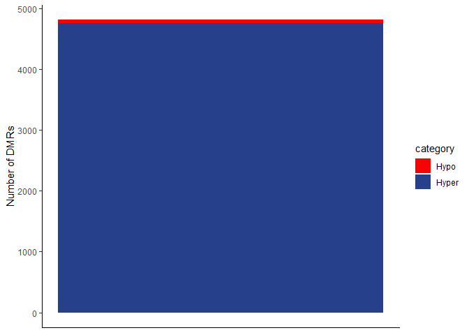
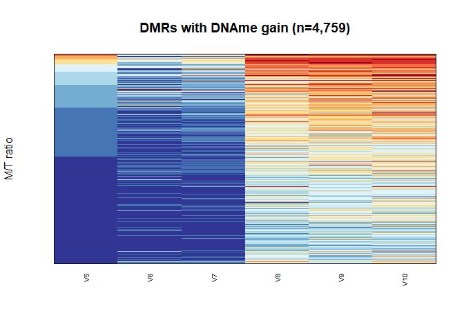
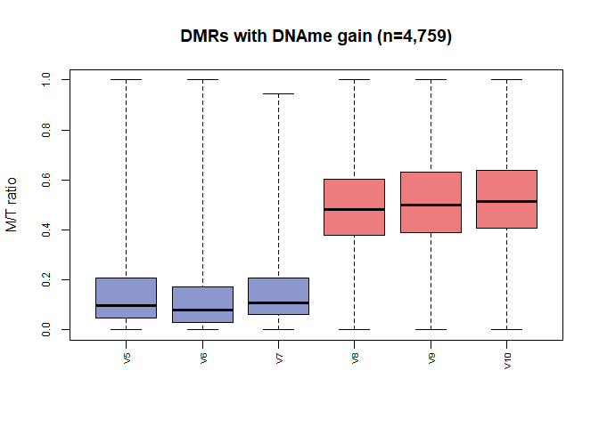
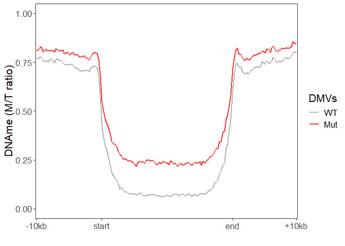
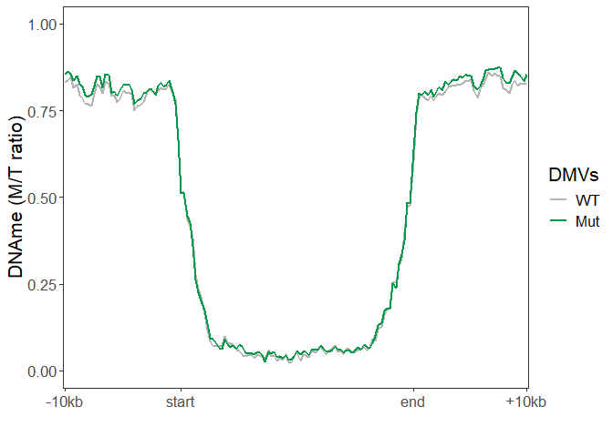
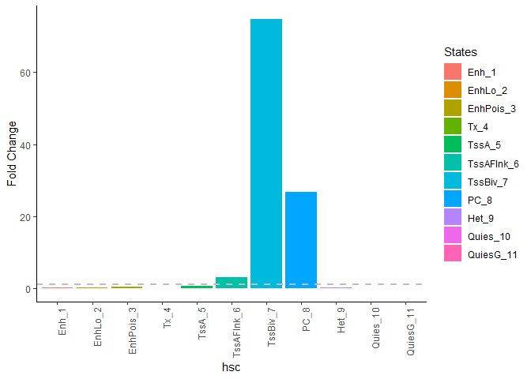

Sarni et al., Figure 4
================
dsarni
25-02-2026

## Figure 4. Hypermethylation of Dnmt3a W326R/+ HSCs impacts multilineage differentiation trajectories

1.  Libraries used in this figure.

``` r
library(ggplot2)
library(RColorBrewer)
library(dplyr)
library(stringr)
```

### Figure 4.a. Stacked bar plot - number of DMRs in HSCs

``` r
hsc_dmr <- data.frame(
  category = (c("Hypo", "Hyper")),
  value = c(56,4759)
)

# Keep the order for plotting
hsc_dmr$category <- factor(hsc_dmr$category, levels = c("Hypo", "Hyper"))

# Plot
ggplot(hsc_dmr, aes(x = 1, y = value, fill = category)) +
  geom_bar(stat = "identity")+
  scale_fill_manual(values = c("red", "royalblue4"))+
  ylab("Number of DMRs")+
  theme_classic()+
  theme(
    axis.text.x = element_blank(),
    axis.ticks.x = element_blank(),
    axis.title.x = element_blank()
  )
```

<!-- -->

2.  Import data.

``` r
# Figure 4.b,c. Mean DNA methylation along hypermethylated DMRs in HSC
hsc.dmr.mean <- read.table("../data/Figure_4/Figure_4bc_hsc_emseq_gain_dmr_meth.bed")

# Figure 4.e. DMV metaplots
# Polycomb marked DMVs, i.e. H3K27me3 "high"
hsc_high <- read.table("../data/Figure_4/Figure_4e_mDMVs_k27_HIGH_mm10_20K_10K_250_filtered.tsv.gz", header = T)
# Polycomb negative DMVs, i.e. H3K27me3 "low"
hsc_low <- read.table("../data/Figure_4/Figure_4e_mDMVs_k27_LOW_mm10_20K_10K_250_filtered.tsv.gz", header = T)

# Figure 4.f. ChromHMM in Liver E16
hsc_liver_e16 <- read.csv("../data/Figure_4/Figure_4f_hsc_liver_crhmhmm.csv")
```

3.  Check number of DMRs (rows)

``` r
length(hsc.dmr.mean[[1]])
```

    ## [1] 4759

### Figure 2.b heatmap hypermethyalted DMRs in HSCs

``` r
# Order rows by column 5, first +/+ sample
hsc.dmr.mean <- hsc.dmr.mean[order(hsc.dmr.mean$V5),]

image(x = c(1:ncol(hsc.dmr.mean[,5:10])),
      y = c(1:nrow(hsc.dmr.mean[,5:10])),
      z = t(hsc.dmr.mean[,5:10]),
      col = rev(brewer.pal(10, "RdYlBu")), breaks = seq(0,1,by=0.1),
      axes = F, xlab = "", ylab = "M/T ratio",
      main = "DMRs with DNAme gain (n=4,759)")
box()
mtext(colnames(hsc.dmr.mean)[5:10], line = 0.75, side = 1, at = c(1:6),
      cex = 0.6, las = 2)
```

<!-- -->

### Figure 4.c. boxplot - quantification of Figure 4.b

``` r
boxplot(hsc.dmr.mean[,5:10],
        cex = 0.5,
        cex.axis = 0.75,
        names = rep("", times=6), 
        range = 0,
        main = "DMRs with DNAme gain (n=4,759)",
        ylab = "M/T ratio",
        col = c(rep("#8c97ce",3),rep("#ec7c7e",3)))
mtext(colnames(hsc.dmr.mean)[5:10], line = 0.75, side = 1, at = c(1:6),
      cex = 0.6, las = 2)
```

<!-- -->

4.  For Figure 4.e. Separate matrix into individual samples

``` r
# K27.high
wt1.k27.high <- hsc_high[,1:160]
wt2.k27.high <- hsc_high[,161:320]
wt3.k27.high <- hsc_high[,321:480]
mut4.k27.high <- hsc_high[,481:640]
mut5.k27.high <- hsc_high[,641:800]
mut6.k27.high <- hsc_high[,801:960]

# K27.low
wt1.k27.low <- hsc_low[,1:160]
wt2.k27.low <- hsc_low[,161:320]
wt3.k27.low <- hsc_low[,321:480]
mut4.k27.low <- hsc_low[,481:640]
mut5.k27.low <- hsc_low[,641:800]
mut6.k27.low <- hsc_low[,801:960]
```

5.  Generate mean pileup matrix for plotting

``` r
##################
# hDMV at high k27
##################

pileup_hsc_df_high <- data.frame(wt1 = NA,
                                 wt2 = NA,
                                 wt3 = NA,
                                 mut4 = NA,
                                 mut5 = NA,
                                 mut6 = NA)

for(i in 1:length(wt1.k27.high)){
  
  pileup_hsc_df_high[i,1] <- mean(wt1.k27.high[,i], na.rm = T)
  pileup_hsc_df_high[i,2] <- mean(wt2.k27.high[,i], na.rm = T)
  pileup_hsc_df_high[i,3] <- mean(wt3.k27.high[,i], na.rm = T)
  
  pileup_hsc_df_high[i,4] <- mean(mut4.k27.high[,i], na.rm = T)
  pileup_hsc_df_high[i,5] <- mean(mut5.k27.high[,i], na.rm = T)
  pileup_hsc_df_high[i,6] <- mean(mut6.k27.high[,i], na.rm = T)
  
}

pileup_hsc_df_high$X <- as.character(row.names(pileup_hsc_df_high), ordered = T)
pileup_hsc_df_high$X <- factor(pileup_hsc_df_high$X, levels = unique(pileup_hsc_df_high$X))

pileup_hsc_df_high$WT <- rowMeans(pileup_hsc_df_high[,1:3])
pileup_hsc_df_high$Mut <- rowMeans(pileup_hsc_df_high[,4:6])

#################
# hDMV at low k27
#################

pileup_hsc_df_low <- data.frame(wt1 = NA,
                                 wt2 = NA,
                                 wt3 = NA,
                                 mut4 = NA,
                                 mut5 = NA,
                                 mut6 = NA)

for(i in 1:length(wt1.k27.low)){
  
  pileup_hsc_df_low[i,1] <- mean(wt1.k27.low[,i], na.rm = T)
  pileup_hsc_df_low[i,2] <- mean(wt2.k27.low[,i], na.rm = T)
  pileup_hsc_df_low[i,3] <- mean(wt3.k27.low[,i], na.rm = T)
  
  pileup_hsc_df_low[i,4] <- mean(mut4.k27.low[,i], na.rm = T)
  pileup_hsc_df_low[i,5] <- mean(mut5.k27.low[,i], na.rm = T)
  pileup_hsc_df_low[i,6] <- mean(mut6.k27.low[,i], na.rm = T)
  
}

pileup_hsc_df_low$X <- as.character(row.names(pileup_hsc_df_low), ordered = T)
pileup_hsc_df_low$X <- factor(pileup_hsc_df_low$X, levels = unique(pileup_hsc_df_low$X))

pileup_hsc_df_low$WT <- rowMeans(pileup_hsc_df_low[,1:3])
pileup_hsc_df_low$Mut <- rowMeans(pileup_hsc_df_low[,4:6])
```

### Figure 4.e. mDMV Polycomb positive

``` r
ggplot(data = pileup_hsc_df_high, aes(x=X))+
  
  geom_line(aes(y=WT, colour = "WT", group =1), linewidth = 1)+
  geom_line(aes(y=Mut, colour = "Mut", group =1), linewidth = 1)+
  
  scale_x_discrete(breaks = c(1, 41, 121, 160), labels = c("-10kb", "start", "end", "+10kb")) +
  scale_colour_manual(name = "DMVs", 
                      values = c("grey70", "#ff3333"),
                      breaks=c("WT","Mut"), 
                      labels=c("WT","Mut"))+
  xlab("")+
  ylab("DNAme (M/T ratio)")+
  ylim(c(0,1))+
  theme_bw()+
  theme(text = element_text(size = 16),
        panel.grid.major = element_blank(),
        panel.grid.minor = element_blank())
```

<!-- -->

### Figure 4.e. mDMV Polycomb negative

``` r
ggplot(data = pileup_hsc_df_low, aes(x=X))+
  
  geom_line(aes(y=WT, colour = "WT", group =1), linewidth = 1)+
  geom_line(aes(y=Mut, colour = "Mut", group =1), linewidth = 1)+
  
  scale_x_discrete(breaks = c(1, 41, 121, 160), labels = c("-10kb", "start", "end", "+10kb")) +
  scale_colour_manual(name = "DMVs", 
                      values = c("grey70", "#04984a"),
                      breaks=c("WT","Mut"), #"wt1","wt2","wt3","mut4","mut5","mut6"
                      labels=c("WT","Mut"))+
  xlab("")+
  ylab("DNAme (M/T ratio)")+
  ylim(c(0,1))+
  theme_bw()+
  theme(text = element_text(size = 16),
        panel.grid.major = element_blank(),
        panel.grid.minor = element_blank())
```

<!-- -->

6.  For Figure 4.f. Keep the order of features as they are in column 6,
    ‘description’.

``` r
hsc_liver_e16$States <- factor(hsc_liver_e16$States, levels = hsc_liver_e16$States)
```

5.  A function to barplot

``` r
plot_summary <- function(summary_table, table_number) {
  
  # Calculate fold change
  summary_table <- summary_table %>%
    mutate(fold_change = dmr_percentage / total_percentage)
  
  # Extract numeric part of the state for ordering
  summary_table <- summary_table %>%
    mutate(state_num = as.numeric(str_extract(States, "\\d+")))
  
  # Create barplot with states ordered by their numeric part
  ggplot(summary_table, aes(x = reorder(States, state_num), y = fold_change, fill = States)) +
    geom_bar(stat = "identity") +
    geom_hline(yintercept = 1, linetype = "dashed", color = "grey", linewidth = 0.75)+
    labs(x = paste(table_number), y = "Fold Change") +
    theme_classic() +
    theme(axis.text.x = element_text(angle = 90, hjust = 1))
 
 }
```

#### Figure 4.f

``` r
plot_summary(hsc_liver_e16, "hsc")
```

<!-- -->

6.  Use Fisher’s exact test to check if there is a significant
    enrichment at bivalent promoters (States=7) and Polycomb regions
    (States = 8)

``` r
# TssBiv_7
TssBiv_7 <- data.frame(all = c(hsc_liver_e16[7,2], sum(hsc_liver_e16[c(1:6,8:11),2])),
                    DMR = c(hsc_liver_e16[7,3], sum(hsc_liver_e16[c(1:6,8:11),3])))
fisher.test(TssBiv_7)
```

    ## 
    ##  Fisher's Exact Test for Count Data
    ## 
    ## data:  TssBiv_7
    ## p-value < 2.2e-16
    ## alternative hypothesis: true odds ratio is not equal to 1
    ## 95 percent confidence interval:
    ##  0.009480241 0.009861755
    ## sample estimates:
    ##  odds ratio 
    ## 0.009689218

``` r
# PC_8
PC_8 <- data.frame(all = c(hsc_liver_e16[8,2], sum(hsc_liver_e16[c(1:7,9:11),2])),
                       DMR = c(hsc_liver_e16[8,3], sum(hsc_liver_e16[c(1:7,9:11),3])))
fisher.test(PC_8)
```

    ## 
    ##  Fisher's Exact Test for Count Data
    ## 
    ## data:  PC_8
    ## p-value < 2.2e-16
    ## alternative hypothesis: true odds ratio is not equal to 1
    ## 95 percent confidence interval:
    ##  0.01322215 0.01365826
    ## sample estimates:
    ## odds ratio 
    ##   0.013431

``` r
sessionInfo()
```

    ## R version 4.5.0 (2025-04-11 ucrt)
    ## Platform: x86_64-w64-mingw32/x64
    ## Running under: Windows 11 x64 (build 26100)
    ## 
    ## Matrix products: default
    ##   LAPACK version 3.12.1
    ## 
    ## locale:
    ## [1] LC_COLLATE=English_United Kingdom.utf8 
    ## [2] LC_CTYPE=English_United Kingdom.utf8   
    ## [3] LC_MONETARY=English_United Kingdom.utf8
    ## [4] LC_NUMERIC=C                           
    ## [5] LC_TIME=English_United Kingdom.utf8    
    ## 
    ## time zone: Europe/London
    ## tzcode source: internal
    ## 
    ## attached base packages:
    ## [1] stats     graphics  grDevices utils     datasets  methods   base     
    ## 
    ## other attached packages:
    ## [1] stringr_1.5.1      dplyr_1.1.4        RColorBrewer_1.1-3 ggplot2_3.5.2     
    ## 
    ## loaded via a namespace (and not attached):
    ##  [1] vctrs_0.6.5       cli_3.6.5         knitr_1.50        rlang_1.1.6      
    ##  [5] xfun_0.52         stringi_1.8.7     generics_0.1.4    labeling_0.4.3   
    ##  [9] glue_1.8.0        htmltools_0.5.8.1 scales_1.4.0      rmarkdown_2.29   
    ## [13] grid_4.5.0        evaluate_1.0.4    tibble_3.3.0      fastmap_1.2.0    
    ## [17] yaml_2.3.10       lifecycle_1.0.4   compiler_4.5.0    pkgconfig_2.0.3  
    ## [21] rstudioapi_0.17.1 farver_2.1.2      digest_0.6.37     R6_2.6.1         
    ## [25] tidyselect_1.2.1  pillar_1.11.0     magrittr_2.0.3    withr_3.0.2      
    ## [29] tools_4.5.0       gtable_0.3.6
